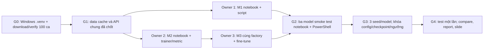

# Kế hoạch công việc — BraTS 2015 Light Benchmark

> **Phân công:** 3 thành viên, **mỗi thành viên sở hữu đúng một mức M1/M2/M3**. Các module dùng chung có một owner và hai reviewer.
>
> **Hệ chạy bắt buộc:** Windows Python 3.12, project `.venv` tạo bằng Windows; notebook `.ipynb` là luồng chính, PowerShell gọi file `.py` là luồng thứ hai.
> **Trạng thái hiện tại:** repo đã có cấu trúc thư mục, config, `.venv` Windows, downloader/verifier và danh sách chọn 100 ca; 201/201 file đã qua kiểm kích thước, SHA-1 nguồn, header và SHA-256 cục bộ. Notebook/train/evaluate chưa triển khai. Điểm số, hình mô hình và thời gian train thực chưa có.

## 1. Định nghĩa thành phẩm và phạm vi

**Bài toán chung:** phân đoạn nhị phân WT trên FLAIR của BraTS 2015. Dataset gốc có nhãn OT `{0,1,2,3,4}`; WT = 1 với `{1,2,3,4}`. Tập con gồm 80 HGG + 20 LGG, **`case_id = grade/patient_id`**; chia 70 train / 15 validation / 15 test, 32 lát/ca, 128×128. Một `patient_id` có thể xuất hiện trong cả HGG/LGG nên tuyệt đối không dùng `patient_id` đơn lẻ làm khóa split. Toàn bộ quy tắc chọn/split đã nằm trong `data/source_manifest.json`, `data/splits_v1.csv` và `configs/benchmark.yaml`.

**Mỗi Mx phải có:** notebook riêng chạy từ clean kernel, Python entry point chạy từ PowerShell qua cùng package, config, model, 3 seed, validation curves, checkpoint, ngưỡng được chọn trên validation, ảnh overlay, bảng metric và giải thích kết quả. M2 và M3 dùng **cùng U-Net/ResNet-18 factory/decoder**; M3 khác encoder pretrained và lịch fine-tune. Bảng benchmark cuối báo cáo điểm thật, chi phí và giới hạn tập con.

### Bản đồ trách nhiệm

| Owner | Mức của mình | Module dùng chung do owner tạo | Reviewer chính | Đầu ra trọng tâm |
|---|---|---|---|---|
| **Thành viên 1** | **M1 — CNN nông** | Audit `.mha`, preprocessing, cache, DataLoader, notebook chuẩn bị dữ liệu | Thành viên 2 kiểm shape/loader; thành viên 3 kiểm split/leakage | `M1/M1.ipynb`, data pipeline, M1 result |
| **Thành viên 2** | **M2 — U-Net scratch** | U-Net factory, loss/trainer/checkpoint, patient-level metric | Thành viên 1 kiểm input/mask; thành viên 3 kiểm factory M2/M3 và test lock | `M2/M2.ipynb`, training/evaluation engine, M2 result |
| **Thành viên 3** | **M3 — transfer learning** | Windows entry points, profiling, notebook so sánh, báo cáo tích hợp | Thành viên 2 kiểm fine-tune; thành viên 1 kiểm data/split đúng | `M3/M3.ipynb`, script PowerShell parity, benchmark/report |

Một người **không sửa im lặng** module chung do người khác sở hữu. Đổi `splits_v1.csv`, định nghĩa WT, preprocessing, loss hoặc metric phải thông báo cả nhóm và cập nhật config/tài liệu trước khi chạy lại.

## 2. Luồng thực hiện và cổng bàn giao



| Gate | Điều kiện để qua gate | Owner xác nhận |
|---|---|---|
| **G0 — dữ liệu và Windows** | `verify_dataset.py --write-checksums` thành công; 201 file đúng kích thước/header; `.venv\Scripts\python.exe` và notebook kernel cùng Python Windows; `torch.cuda.is_available()` được ghi. | 1 xác nhận dữ liệu; 3 xác nhận môi trường; 2 review. |
| **G1 — hợp đồng mã** | Có `prepare_data`, `train_model`, `evaluate_model`, `compare_runs` hoặc API tương đương đã thống nhất; config/path/run artifact đã chốt; không có import qua sửa `sys.path`. | 1 + 2 + 3 cùng duyệt. |
| **G2 — smoke hai cách chạy** | Mỗi Mx chạy 1 epoch trên tập smoke riêng bằng notebook **Restart + Run All** và PowerShell `scripts/train.py`; output shape/metric đúng; không dùng kết quả smoke làm benchmark. | Owner Mx và một reviewer khác. |
| **G3 — huấn luyện cuối** | 3 seed `42,123,2026`/Mx trên split cố định; mọi config, checkpoint và ngưỡng được chọn bằng validation; khóa các artifact trước khi mở test. | 1/2/3 ký cho Mx của mình; 3 tổng hợp. |
| **G4 — báo cáo** | Test mỗi checkpoint một lần, metric theo ca, bảng độ bất định/chi phí, ví dụ đúng/sai, README và slide khớp CSV; không có MRI/checkpoint lớn trong Git. | Cả ba review chéo. |

### Hợp đồng file/API cần chốt ở G1

- `configs/benchmark.yaml` giữ quy tắc chung; `configs/m1.yaml`, `m2.yaml`, `m3.yaml` chỉ giữ khác biệt từng model. Notebook/script cùng nạp các file này.
- `data/splits_v1.csv` là nguồn sự thật cho `case_id`, `grade`, `split`, `flair_relpath`, `mask_relpath`. Đường dẫn tương đối tính từ project root bằng `pathlib.Path`.
- `src/brats_benchmark/pipeline.py` có API thống nhất, ví dụ `prepare_data(config_path)`, `train_model(model_id, seed, smoke=False)`, `evaluate_model(model_id, seed, split)`, `compare_runs(...)`. Chữ ký có thể chỉnh ở G1, nhưng **notebook và `scripts/*.py` phải gọi cùng một implementation**.
- `runs/<model>/<seed>/` gồm `config.json`, `history.csv`, `best.pt`, `threshold.json`, `environment.json`; `runs/smoke/` tách riêng.
- `reports/per_patient.csv` ít nhất có `model,seed,case_id,grade,split,dice,iou,precision,recall`; `reports/benchmark.csv` có mean/std/CI, tham số, thời gian train và inference.
- Notebook chuẩn: mục tiêu → nguồn/trích dẫn → kiểm tra Windows kernel/CUDA → config/split → model summary → train hoặc load checkpoint → learning curves → validation/tham số ngưỡng → overlay và lỗi → kết luận/giới hạn. Không phụ thuộc biến còn lại từ notebook trước.

## 3. G0 — môi trường và dataset dùng chung

Thư mục dự án chính đã có `scripts/download_dataset.py` thuần thư viện chuẩn Python. Torrent gốc chứa web seed Archive.org; đường tải đã được thử trên PowerShell Windows với một cặp FLAIR–OT. Chạy từ project root:

```powershell
py -3.12 .\scripts\download_dataset.py --workers 4
py -3.12 .\scripts\verify_dataset.py --write-checksums
```

Script đối chiếu torrent gốc với inventory của bản sao HTTPS Archive.org, chọn **80 trong 100 HGG** và **20 trong 54 LGG** có FLAIR/OT hoàn chỉnh. Nó tải **200 file `.mha` + file giấy phép**, tổng khoảng **0,870 GiB**, vào `data/raw/BRATS2015/training/{HGG,LGG}/...`; chạy lại tự bỏ qua file đủ kích thước và giữ nguyên danh sách ca đã khóa trong `data/source_manifest.json`. Bảng split được tạo cùng lúc. File gốc và `.venv` không commit; `source_manifest.json`, `splits_v1.csv`, `file_sha256.csv` có thể commit. Nếu `verify_dataset.py` báo thiếu file, tải lại; **không khởi động train trên tập dữ liệu chưa đủ**.

**Windows setup:** dùng `py -3.12 -m venv .venv`, cài PyTorch CUDA theo [selector chính thức cho Windows/Pip/CUDA](https://docs.pytorch.org/get-started/locally/), rồi `& .\.venv\Scripts\python.exe -m pip install -r requirements.txt` và `-m pip install -e .`. Đăng ký `ipykernel` từ cùng interpreter. Không dùng `.venv` được tạo từ WSL, notebook WSL kernel, đường dẫn `/mnt/...` hoặc shell Linux. Chạy `scripts/profile.py` trên Windows sau khi có trainer để thay số phút dự đoán bằng số đo thật.

## 4. Thành viên 1 — M1 và dữ liệu chung

**Mục tiêu riêng:** xây baseline CNN nông có thể train/inference thật và tạo lớp dữ liệu dùng chung để M2/M3 chỉ thay model. Không sửa U-Net factory hoặc metric của thành viên 2.

| ID | Công việc cụ thể | File chính/đầu ra | Tiêu chí nghiệm thu |
|---|---|---|---|
| **M1-01** | Đọc `source_manifest.json`, `splits_v1.csv`, kiểm 100 `case_id`, HGG/LGG, file FLAIR/OT, shape/spacing/nhãn. Ghi ca lỗi minh bạch. | `src/brats_benchmark/data/audit.py`, `data/excluded_cases.csv`, `notebooks/00_prepare.ipynb` | Không có ca trùng split; kiểm được ít nhất 5 cặp ảnh–mask trực quan; không lấy `testing`. |
| **M1-02** | Đọc `.mha` bằng SimpleITK; chọn 32 lát theo 20–80% độ sâu từ shape ảnh; resize ảnh bilinear/mask nearest; WT nhị phân; chuẩn hóa theo median/IQR voxel khác 0; cache. | `src/brats_benchmark/data/mha_reader.py`, `src/brats_benchmark/data/preprocess.py`, `data/processed/` | Mỗi ca tạo đúng 32 cặp 128×128; mask chỉ 0/1; cache tái tạo đúng từ config; không dùng mask để chọn lát. |
| **M1-03** | Tạo Dataset/DataLoader và augmentation đồng bộ ảnh–mask chỉ trên train; cung cấp tensor FLAIR lặp 3 kênh, ImageNet mean/std chung. | `src/brats_benchmark/data/dataset.py`, `tests/test_preprocess.py`, `tests/test_split.py` | M1/M2/M3 đọc cùng batch dữ liệu ở cùng `case_id`; val/test không augmentation; test rò rỉ đi qua. |
| **M1-04** | Cài CNN nông 3 Conv theo `configs/m1.yaml`; trả logits 1 kênh, không sigmoid trong model. | `src/brats_benchmark/models/shallow_fcn.py` | Input `(B,3,128,128)` → logits `(B,1,128,128)`; có số tham số. |
| **M1-05** | Dùng API trainer chung của thành viên 2 để train M1; chọn checkpoint/ngưỡng qua validation; chạy 3 seed sau smoke. | `M1/M1.ipynb`, `runs/m1/<seed>/` | Notebook clean Run All trên Windows; M1 chạy qua `scripts/train.py --model m1` cùng config; không mở test trước G3. |
| **M1-06** | Vẽ learning curves, ít nhất 3 ca validation với overlay, lỗi false positive/lát không u; ghi giới hạn baseline. | `M1/README.md`, `reports/figures/` | Hình có FLAIR, GT, M1 mask; diễn giải gắn với điểm thật. |
| **M1-07** | Review phép metric của M2 trên 2–3 ví dụ tính tay; bàn giao manifest/cache/path contract cho cả nhóm. | Review trong PR/tài liệu; ghi chú bàn giao | Thành viên 2/3 nạp được cache mà không tạo data pipeline riêng. |

**Nguồn đọc cho M1:**

- [Academic Torrents BraTS 2015](https://academictorrents.com/details/c4f39a0a8e46e8d2174b8a8a81b9887150f44d50): cấu trúc file, nhãn OT, license. [Bài báo BRATS của Menze và cộng sự](https://pmc.ncbi.nlm.nih.gov/articles/PMC4833122/): ý nghĩa các vùng u và thiết kế benchmark; cần phân biệt bài báo nền tảng với tập con nội bộ của nhóm.
- [Fully Convolutional Networks for Semantic Segmentation, Long et al.](https://openaccess.thecvf.com/content_cvpr_2015/html/Long_Fully_Convolutional_Networks_2015_CVPR_paper.html): tư tưởng dự đoán mask theo pixel; M1 của nhóm là baseline nhỏ hơn, **không tự nhận tái hiện toàn bộ FCN trong paper**.
- [SimpleITK đọc ảnh](https://simpleitk.readthedocs.io/en/master/link_ImageFileReader_docs.html), [PyTorch Dataset/DataLoader tutorial](https://docs.pytorch.org/tutorials/beginner/basics/data_tutorial.html): để kiểm trục thể tích và thiết kế loader dùng chung.

## 5. Thành viên 2 — M2 và huấn luyện chung

**Mục tiêu riêng:** xây U-Net scratch cùng factory với M3 và toàn bộ cơ chế train/metric chung. Không thay split hoặc tạo preprocessing M2 riêng.

| ID | Công việc cụ thể | File chính/đầu ra | Tiêu chí nghiệm thu |
|---|---|---|---|
| **M2-01** | Cài factory `smp.Unet` theo `configs/m2.yaml`/`m3.yaml`, cố định `encoder_depth`, `decoder_channels`, input/output; M2 `encoder_weights=None`, M3 `imagenet`. | `src/brats_benchmark/models/unet_factory.py` | M2/M3 có cùng kiến trúc và tổng số tham số; input/output shape giống nhau. |
| **M2-02** | Cài `0.5 BCEWithLogits + 0.5 soft Dice`; AdamW, AMP, batch hiệu dụng 16, seed, checkpoint theo validation Dice, early stopping, threshold grid chỉ dùng val. | `src/brats_benchmark/training/losses.py`, `runner.py`, `checkpoint.py` | Không sigmoid hai lần; log loss/val Dice/epoch; lưu đầy đủ config và môi trường; smoke 1 epoch chạy được. |
| **M2-03** | Cài Dice/IoU/precision/recall theo ca từ tổng TP/FP/FN của 32 lát; quy ước mask rỗng; bootstrap theo `case_id`; đo tham số/thời gian/VRAM. | `src/brats_benchmark/evaluation/metrics.py`, `bootstrap.py`, `tests/test_metrics.py` | Ví dụ tính tay và mask rỗng khớp; không dùng lát cắt làm mẫu độc lập khi tính CI. |
| **M2-04** | Triển khai `train_model` và `evaluate_model` trong API chung; CLI `scripts/train.py`, `scripts/evaluate.py` phối hợp thành viên 3. | `src/brats_benchmark/pipeline.py`, script wrapper, tests | Notebook và script dùng cùng trainer/checkpoint/metric; không có vòng train thứ hai trong notebook. |
| **M2-05** | Tạo `M2/M2.ipynb`: mô hình, train, val curves, chọn ngưỡng, overlay, lỗi; chạy smoke rồi 3 seed đầy đủ. | `M2/M2.ipynb`, `runs/m2/<seed>/`, `M2/README.md` | Clean Run All trên Windows `.venv`; PowerShell `--model m2` chạy cùng config; checkpoint val được khóa trước test. |
| **M2-06** | Review chuẩn hóa/cache của M1 và pha mở `layer4`/BatchNorm của M3; chốt công thức metric trong report. | Review/ghi chú chung | M1/M3 không thể thay đổi metric hoặc decoder riêng mà không được phát hiện. |

**Nguồn đọc cho M2:**

- [U-Net, Ronneberger et al.](https://arxiv.org/abs/1505.04597): đường co/mở và skip connections; đọc sơ đồ gốc trước khi giải thích kết quả.
- [ResNet, He et al.](https://openaccess.thecvf.com/content_cvpr_2016/html/He_Deep_Residual_Learning_CVPR_2016_paper.html): residual blocks của encoder ResNet-18.
- [Segmentation Models PyTorch — U-Net implementation](https://github.com/qubvel-org/segmentation_models.pytorch/blob/main/segmentation_models_pytorch/decoders/unet/model.py): `encoder_weights`, depth, decoder channels. [PyTorch BCEWithLogitsLoss](https://docs.pytorch.org/docs/stable/generated/torch.nn.BCEWithLogitsLoss.html), [AMP examples](https://docs.pytorch.org/docs/main/notes/amp_examples.html): loss và huấn luyện CUDA.

## 6. Thành viên 3 — M3 và tích hợp benchmark

**Mục tiêu riêng:** chứng minh transfer learning/fine-tune trên **đúng kiến trúc M2**, bảo đảm hai cách chạy Windows và hoàn thiện bảng/báo cáo chung. Không sử dụng dữ liệu hoặc modality ngoài manifest.

| ID | Công việc cụ thể | File chính/đầu ra | Tiêu chí nghiệm thu |
|---|---|---|---|
| **M3-01** | Chốt Windows `.venv`/kernel/requirements sau khi cài và test; ghi phiên bản torch/CUDA/GPU; tạo `requirements-lock.txt` từ môi trường chạy thật, không commit `.venv`. | README, `requirements-lock.txt`, `reports/hardware_profile.md` | `sys.executable` notebook là `.venv\Scripts\python.exe`; script PowerShell và notebook đều thấy CUDA; lệnh cài tái lập trên Windows. |
| **M3-02** | Dùng factory M2 với encoder ImageNet; giai đoạn 1 freeze toàn encoder và eval BatchNorm, giai đoạn 2 mở `layer4`, LR encoder/decoder theo config; log lớp trainable. | `configs/m3.yaml`, `src/brats_benchmark/training/runner.py` qua phối hợp M2 | Có bằng chứng pretrained weights được nạp; pha 1/2 đúng epoch và LR; encoder đóng băng không nhận gradient. |
| **M3-03** | Tạo `M3/M3.ipynb`: giải thích transfer, sơ đồ, hai pha train, curves, overlay, lỗi, giới hạn chuyển từ ảnh tự nhiên sang MRI; chạy smoke và 3 seed. | `M3/M3.ipynb`, `runs/m3/<seed>/`, `M3/README.md` | Clean Run All Windows; PowerShell `--model m3` dùng cùng API và artifacts; không mở test trước G3. |
| **M3-04** | Hoàn thiện wrapper PowerShell `prepare_data.py`, `train.py`, `evaluate.py`, `compare.py`, `profile.py` gọi `pipeline.py`; kiểm notebook/CLI parity. | `scripts/*.py`, `tests/test_entrypoints.py` | Lệnh trong README chạy; cùng seed/config/checkpoint cho dự đoán tương ứng; lỗi thiếu file/CUDA báo rõ. |
| **M3-05** | Profile GPU Windows: warm-up, 100 train step M2, 100 inference step, synchronize CUDA, peak VRAM, thời gian cache/I/O; cập nhật ước lượng. | `scripts/profile.py`, `reports/hardware_profile.md` | Có số đo thật, package version, batch size và thiết bị; không lấy ước lượng làm kết quả. |
| **M3-06** | Sau G3, chạy test một lần/model/seed; gộp `per_patient.csv`/`benchmark.csv`, bootstrap theo `case_id`, bảng accuracy/params/time/VRAM, hình tốt-trung bình-thất bại. | `notebooks/90_compare.ipynb`, `scripts/compare.py`, `reports/` | Điểm CSV khớp hình và báo cáo; không dùng test để chọn model/ngưỡng. |
| **M3-07** | Tích hợp báo cáo/slide, kiểm nguồn trích dẫn và kết luận có giới hạn; nhận nội dung riêng từ M1/M2; rà `.gitignore` trước push. | `reports/report.md`, `reports/slides.pdf`, README cuối | Đủ dataset/method/experiment/result/error/limitation, người khác tái lập bằng notebook hoặc PowerShell; không commit raw MRI. |

**Nguồn đọc cho M3:**

- [PyTorch Transfer Learning Tutorial](https://docs.pytorch.org/tutorials/beginner/transfer_learning_tutorial.html): freeze/fine-tune và ý nghĩa trọng số pretrained.
- [ResNet original paper](https://openaccess.thecvf.com/content_cvpr_2016/html/He_Deep_Residual_Learning_CVPR_2016_paper.html), [Segmentation Models PyTorch encoders](https://github.com/qubvel-org/segmentation_models.pytorch/blob/main/docs/encoders.rst): kiến trúc encoder và tùy chọn ImageNet.
- [PyTorch reproducibility notes](https://docs.pytorch.org/docs/stable/notes/randomness.html): giới hạn của kết quả giữa seed/hardware; [AMP examples](https://docs.pytorch.org/docs/main/notes/amp_examples.html): tốc độ/precision.
- [Python `venv` Windows](https://docs.python.org/3.12/library/venv.html), [IPython kernel install](https://ipython.readthedocs.io/en/stable/install/index.html), [VS Code Jupyter kernel picker](https://code.visualstudio.com/docs/datascience/jupyter-kernel-management): hướng dẫn để cả notebook và PowerShell dùng cùng interpreter.

## 7. Kiểm tra tích hợp cuối và format bàn giao

### Checklist bắt buộc cho từng Mx

- [ ] Notebook có mục tiêu, config/split checksum, mã model thực, validation curve, overlay, nguồn tham khảo, kết luận và giới hạn.
- [ ] Notebook chạy **Restart Kernel + Run All** bằng Windows `.venv` trên tập smoke; sau đó chạy full hoặc load checkpoint để trình bày kết quả thật.
- [ ] PowerShell `& .\.venv\Scripts\python.exe .\scripts\train.py --model <mx> --seed 42` chạy cùng API/config; `evaluate.py` load được checkpoint.
- [ ] `runs/<mx>/<seed>/` có config, history, checkpoint, threshold và môi trường; 3 seed cuối đủ.
- [ ] Metric patient-level và bảng chi phí có nguồn số liệu; ảnh overlay tương ứng cùng `case_id` và checkpoint.
- [ ] Không có đường dẫn cá nhân cố định, dữ liệu raw, `.venv`, checkpoint hoặc log quá lớn trong Git.

### Checklist chung trước khi nộp

- [ ] 100 `case_id`/200 MRI file/1 license có checksum và split 70/15/15 cố định; loại ca lỗi được ghi rõ.
- [ ] M2/M3 cùng factory, decoder và input; khác pretrained weights/lịch train được giải thích.
- [ ] Test chỉ chạy sau khi khóa config/checkpoint/ngưỡng của cả ba; mỗi seed test đúng một lần.
- [ ] `notebooks/90_compare.ipynb` và `scripts/compare.py` tạo cùng bảng kết quả từ cùng `reports/per_patient.csv`.
- [ ] Kết luận chỉ áp dụng cho benchmark FLAIR/WT/100 ca/32 lát; không tuyên bố điểm BraTS chính thức hoặc ứng dụng lâm sàng.
- [ ] `README.md`, `Project_structure.md`, `AGENTS.md`, `Detail_jobs.md` khớp đường dẫn/lệnh chạy và trạng thái thực tế.

### Gợi ý cách chia nhánh và review

- `feature/m1-data-baseline`: thành viên 1 sở hữu data + M1, thành viên 2 review data API, thành viên 3 review split.
- `feature/m2-unet-engine`: thành viên 2 sở hữu U-Net/trainer/metrics + M2, thành viên 1 review I/O, thành viên 3 review M2/M3 parity.
- `feature/m3-transfer-report`: thành viên 3 sở hữu M3/Windows scripts/report, thành viên 2 review fine-tune và metric, thành viên 1 review dữ liệu/figures.
- Hợp nhất module chung sau smoke và review. Khi có xung đột ở config/API, chốt một version chung rồi cập nhật cả ba notebook; không sửa âm thầm một model để "cải thiện điểm".

## 8. Tài liệu nền chung

- [Academic Torrents — BraTS 2015](https://academictorrents.com/details/c4f39a0a8e46e8d2174b8a8a81b9887150f44d50) và [torrent metadata](https://academictorrents.com/download/c4f39a0a8e46e8d2174b8a8a81b9887150f44d50.torrent): nguồn và web seed; [Academic Torrents Getting Started](https://academictorrents.com/docs/getting-started.html).
- [BRATS benchmark paper](https://pmc.ncbi.nlm.nih.gov/articles/PMC4833122/): nền tảng đánh giá u não MRI; lưu ý paper bàn về challenge gốc, còn bài nhóm là tập con tự định nghĩa.
- [PyTorch Windows installation](https://docs.pytorch.org/get-started/locally/), [Python packaging `src` layout](https://packaging.python.org/en/latest/tutorials/packaging-projects/), [VS Code notebooks](https://code.visualstudio.com/docs/datascience/jupyter-notebooks): môi trường, cấu trúc package và notebook.
