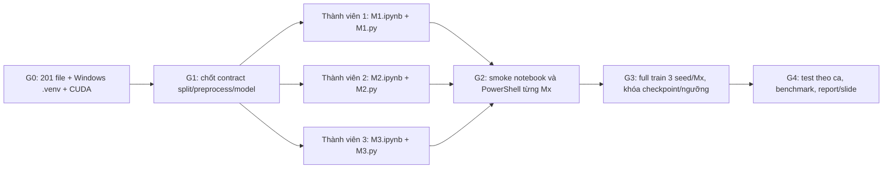

# Phân công và checklist — 1 thành viên / 1 Mx

**Mục tiêu nhóm:** cả ba thành viên hiểu và trình bày được **toàn bộ code ngay trong notebook của mình**. Mỗi Mx có `Mx.ipynb` (chính, code + Markdown) và `Mx.py` (chạy PowerShell), tự chứa từ dữ liệu đến metric, không import mã từ Mx khác. Chỉ dùng chung `.venv` Windows, `data/source_manifest.json`, `data/splits_v1.csv`, `data/file_sha256.csv` và cache cố định. Xem hợp đồng chi tiết ở [Project_structure.md](Project_structure.md) và quy tắc agent ở [AGENTS.md](AGENTS.md).

## 1. Trạng thái và luồng bàn giao

Ngày 28/09/2026, `data/raw/BRATS2015/` có 200 MRI + giấy phép; **201/201 SHA-256 khớp** inventory. Cache đã tạo đủ 100 ca. Sáu file Mx đã được tạo; **ba `.py --smoke` và ba notebook đã chạy trên Windows `.venv`/CUDA**. Kết quả full/test/benchmark chưa được coi là hoàn thành khi chưa chạy và ghi số thật.

| Gate | Điều kiện xong | Bằng chứng |
|---|---|---|
| G0 | 201 file hash đúng, `.venv\Scripts\python.exe` là Windows Python 3.12, `torch.cuda.is_available()` True. | PowerShell kiểm checksum; phiên bản Python/torch/GPU. |
| G1 | Cả sáu file dùng cùng split, 32 lát/ca, preprocessing, loss, metric, threshold grid. M2/M3 cùng class `ResidualUNet`. | Review code trong notebook và `.py`, đối chiếu output batch/shape. |
| G2 | Từng Mx **Restart Kernel + Run All** với `ACTION="smoke"`; `Mx.py --smoke` chạy cùng `.venv`; có `best.pt`, `history.csv`, `metrics_val.csv`, `preview.png`. | Log/lệnh, artifacts trong `runs/smoke/`, không đưa điểm smoke vào bảng cuối. |
| G3 | Chạy `--train --seed 42`, `123`, `2026` cho từng Mx; chọn checkpoint/ngưỡng chỉ trên val. | `runs/<mx>/<seed>/` đủ artifacts, thời gian/VRAM/phiên bản. |
| G4 | Sau khi ba Mx khóa cấu hình, `--test` hoặc `ACTION="test"` cho từng seed, gộp bảng theo ca, viết nhận xét và slide. | `metrics_test.csv`, bảng Dice/IoU theo bệnh nhân, hình, report nguồn rõ. |

## 2. Contract chung để code tự chứa vẫn benchmark công bằng

- **Nguồn sự thật:** `data/splits_v1.csv` có `case_id = grade/patient_id`; không tạo split riêng. `data/file_sha256.csv` kiểm raw; cache `data/processed/flair_wt_v1/` chứa 32 lát 128×128 FLAIR/WT từ quy tắc chung.
- **Tiền xử lý giống nhau:** 20–80% độ sâu ảnh, resize bilinear/nearest, median/IQR FLAIR voxel khác 0, clip và đưa `[0,1]`, nền 0, lặp 3 kênh/ImageNet normalization. Lật ngang chỉ train.
- **Huấn luyện/đánh giá giống nhau:** batch 16 full, 30 epoch tối đa, seed 42/123/2026, loss 0.5 BCEWithLogits + 0.5 soft Dice, checkpoint và threshold từ mean Dice patient-level trên validation. Test sau G3. Không coi 32 lát là 32 bệnh nhân.
- **Tự chứa:** không tạo `scripts/`, `src/`, package, notebook phụ, `%run` hoặc import `Mx.py` vào notebook. Mỗi notebook trình bày code trực tiếp theo các bước; `.py` cùng folder có cùng logic. Khi một thành viên sửa contract, cả ba thành viên sửa sáu file và tài liệu trước khi train lại.
- **Artifact:** `runs/smoke/<mx>/<seed>/` hoặc `runs/<mx>/<seed>/` có checkpoint, history, val/test CSV và preview. MRI/cache/checkpoint lớn không commit. `reports/` chỉ nhận kết quả đã chạy thật.

## 3. Thành viên 1 — M1, baseline đơn giản

| ID | Việc cần làm | File/đầu ra | Tiêu chí nghiệm thu |
|---|---|---|---|
| M1-01 | Đọc kỹ `M1/M1.ipynb` và `M1/M1.py`; giải thích từng cell/hàm từ SHA-256, split đến OT→WT, cache và DataLoader. Kiểm trục SimpleITK, shape/spacing, giá trị nhãn ở 5 ca. | `M1/README.md`, ghi chú kiểm dữ liệu | Không có ca sai hoặc ghi rõ ca lỗi; giải thích được vì sao split theo `grade/patient_id`. |
| M1-02 | Kiểm công thức chuẩn hóa và ảnh GT thực; bảo đảm cùng tensor đầu vào với M2/M3, augmentation chỉ train. Nếu sửa, cập nhật cả sáu file và cache version. | `M1.ipynb`, `M1.py`, `data/processed/` | Một ca qua ba Mx cho tensor/mask cùng shape/giá trị; mask chỉ 0/1. |
| M1-03 | Giải thích CNN nông 3 Conv, logits, BCE + soft Dice, Dice theo ca; chạy smoke cả notebook lẫn PowerShell trên Windows `.venv`. | `runs/smoke/m1/42/` | Clean Run All; `M1.py --smoke` thành công; có checkpoint/curve CSV/preview; không dùng số smoke làm benchmark. |
| M1-04 | Chạy full 3 seed; đọc learning curve, phân tích baseline thường bỏ sót vùng u, ghi thời gian/VRAM và 3 overlay validation. | `runs/m1/{42,123,2026}/`, `M1/README.md` | Checkpoint/ngưỡng chỉ chọn qua val; người khác lặp lại bằng notebook và PowerShell. |
| M1-05 | Review split/geometry đầu vào của M2/M3; sau G3 chạy test M1 mỗi seed một lần, bàn giao CSV theo ca. | `metrics_test.csv`, review | 15 ca test/seed, không chọn lại model sau test. |

**Nguồn đọc M1:** [BraTS 2015](https://academictorrents.com/details/c4f39a0a8e46e8d2174b8a8a81b9887150f44d50), [BRATS paper](https://pmc.ncbi.nlm.nih.gov/articles/PMC4833122/), [FCN paper](https://openaccess.thecvf.com/content_cvpr_2015/html/Long_Fully_Convolutional_Networks_2015_CVPR_paper.html), [SimpleITK image reader](https://simpleitk.readthedocs.io/en/master/link_ImageFileReader_docs.html), [PyTorch Dataset/DataLoader](https://docs.pytorch.org/tutorials/beginner/basics/data_tutorial.html).

## 4. Thành viên 2 — M2, U-Net/ResNet-18 từ đầu

| ID | Việc cần làm | File/đầu ra | Tiêu chí nghiệm thu |
|---|---|---|---|
| M2-01 | Giải thích từng mức e0–e4 của ResNet-18, 4 up-block, skip connection, head; so sánh class `ResidualUNet` với M3 để chứng minh cùng kiến trúc. | `M2/M2.ipynb`, `M2/M2.py`, `M2/README.md` | Input `(B,3,128,128)` → logits `(B,1,128,128)`; M2/M3 cùng số tham số. |
| M2-02 | Kiểm khởi tạo random, loss, AdamW, AMP, threshold grid val, checkpoint chọn theo patient mean Dice; giải thích trường hợp mask rỗng. | Code hiện trong M2 notebook/`.py` | Không sigmoid hai lần; không dùng test để chọn threshold; metric ví dụ tính tay khớp. |
| M2-03 | Chạy smoke notebook clean kernel và PowerShell; sửa lỗi Windows/CUDA/path trong **cả hai file M2**. | `runs/smoke/m2/42/` | Cùng artifacts và split; không import M1/M3. |
| M2-04 | Chạy full 3 seed; đo epoch time/peak VRAM, vẽ learning curve và overlay val, so với M1. | `runs/m2/{42,123,2026}/`, `M2/README.md` | Có số thật, config/phiên bản lưu; không gán điểm test trước G3. |
| M2-05 | Review M3 freeze/layer4 và parity kiến trúc; sau G3 chạy test M2, kiểm CSV theo ca. | Review, `metrics_test.csv` | M2/M3 chỉ khác pretrained weights và lịch train đã nêu. |

**Nguồn đọc M2:** [U-Net paper](https://arxiv.org/abs/1505.04597), [ResNet paper](https://openaccess.thecvf.com/content_cvpr_2016/html/He_Deep_Residual_Learning_CVPR_2016_paper.html), [torchvision ResNet-18](https://docs.pytorch.org/vision/main/models/generated/torchvision.models.resnet18), [BCEWithLogitsLoss](https://docs.pytorch.org/docs/stable/generated/torch.nn.BCEWithLogitsLoss.html), [PyTorch AMP examples](https://docs.pytorch.org/docs/stable/notes/amp_examples.html).

## 5. Thành viên 3 — M3, transfer learning và tích hợp

| ID | Việc cần làm | File/đầu ra | Tiêu chí nghiệm thu |
|---|---|---|---|
| M3-01 | Xác nhận cùng Windows `.venv`/CUDA cho notebook và `.py`, lưu phiên bản package, GPU và lệnh cài đúng; không dùng WSL. | `M3/README.md`, thông tin môi trường trong `runs/` | `sys.executable` là `.venv\Scripts\python.exe`, `torch.cuda.is_available()` True. |
| M3-02 | Giải thích `ResNet18_Weights.IMAGENET1K_V1`, kiểm weights được tải; pha 1 freeze encoder và BN eval, pha 2 mở `layer4` với LR 1e-5/decoder 1e-4. | `M3/M3.ipynb`, `M3/M3.py` | Encoder không nhận gradient pha 1; layer4 nhận gradient pha 2; decoder/head luôn học. |
| M3-03 | Chạy smoke notebook clean kernel và PowerShell; đối chiếu shape, model class và metric với M2, sửa hai file M3 cùng lúc. | `runs/smoke/m3/42/` | Run All và `M3.py --smoke` đều ra artifacts; không import code M2. |
| M3-04 | Chạy full 3 seed; ghi thời gian/VRAM, val curve, overlay, giới hạn chuyển weights ảnh tự nhiên sang MRI. | `runs/m3/{42,123,2026}/`, `M3/README.md` | Checkpoint/ngưỡng khóa bằng validation, có bằng chứng stage 1/2. |
| M3-05 | Sau G3, chạy test M3; gộp `metrics_test.csv` của ba Mx, tính mean/std và bootstrap theo **bệnh nhân**, bảng Dice/IoU/params/time/VRAM. | `reports/benchmark.csv`, `reports/report.md` | Số bảng/hình khớp CSV gốc; không tune bằng test; nêu rõ 15 ca test và giới hạn cohort. |
| M3-06 | Tích hợp báo cáo/slide và rà README/AGENTS/repo trước nộp; giữ `slides/` hiện có của người dùng. | `reports/`, slide nhóm | Người đọc có thể chạy lại Mx bằng notebook hoặc PowerShell; Git không có MRI/.venv/checkpoint. |

**Nguồn đọc M3:** [PyTorch transfer learning tutorial](https://docs.pytorch.org/tutorials/beginner/transfer_learning_tutorial.html), [torchvision ResNet-18 weights](https://docs.pytorch.org/vision/main/models/generated/torchvision.models.resnet18), [PyTorch reproducibility](https://docs.pytorch.org/docs/stable/notes/randomness.html), [AMP](https://docs.pytorch.org/docs/stable/notes/amp_examples.html), [Python venv Windows](https://docs.python.org/3.12/library/venv.html), [Jupyter kernel](https://ipython.readthedocs.io/en/stable/install/index.html).

## 6. Checklist nhóm trước khi nộp

- [ ] Cả ba notebook chạy **Restart Kernel + Run All** bằng Windows `.venv` ở smoke; cả ba `Mx.py --smoke` chạy từ PowerShell root.
- [ ] Full train/validation đủ 3 seed × 3 Mx; `runs/mx/seed/` có checkpoint, history, CSV validation, preview, thông tin thời gian/VRAM.
- [ ] M2/M3 cùng class/decoder/input; M3 có bằng chứng pretrained và hai pha fine-tune.
- [ ] Test chỉ sau G3; 15 ca/test/seed, patient-level Dice/IoU, benchmark và hình có nguồn từ CSV thật.
- [ ] README, Project_structure, Detail_jobs, AGENTS và Mx/README khớp code/lệnh, không ghi kết quả ước lượng như số đo.
- [ ] Không commit `.venv/`, MRI raw, cache, checkpoint, log lớn hoặc tài liệu nhạy cảm.
