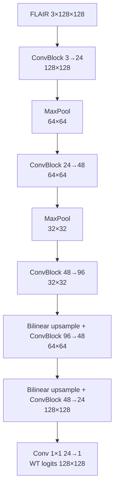

# M1 — CNN nhỏ phân đoạn whole tumor

[M1.ipynb](M1.ipynb) là bản trình bày và chạy chính. Một lần **Restart Kernel + Run All** sẽ đi hết luồng: nạp dữ liệu → xem ảnh → tạo DataLoader → dựng CNN → train → xem điểm validation/biểu đồ/ảnh → đánh giá **test thật**. Notebook không có `ACTION`; chỉ đổi `SEED` ở ô đầu (42, 123 hoặc 2026) khi cần chạy seed khác. M1 không chờ checkpoint của M2/M3.

## Dữ liệu và model

- 100 ca BraTS 2015: 70 train, 15 validation, 15 test theo `case_id = grade/patient_id`. Mỗi ca lấy 32 lát FLAIR từ 20–80% độ sâu **ảnh**, không dùng mask để chọn lát. WT là OT thuộc `{1,2,3,4}`.
- FLAIR chuẩn hóa median/IQR voxel khác 0, resize 128×128, lặp 3 kênh và ImageNet mean/std. Chỉ train mới lật ngang ảnh/mask đồng bộ. Cache chung ở `data/processed/flair_wt_v1/`.
- `ConvBlock` gồm hai lần `Conv2d 3×3 → BatchNorm → ReLU`. Mạng học từ đầu, không pretrained và không skip connection.



Loss là `0.5 BCEWithLogits + 0.5 soft Dice`. Một AdamW (`lr=1e-3`, weight decay `1e-4`) dùng suốt run; scheduler giảm learning rate khi validation đứng yên. Tối đa 30 epoch, dừng sớm sau tối thiểu 8 epoch và 6 epoch không cải thiện. Checkpoint/ngưỡng 0.30–0.70 được chọn bằng mean Dice **theo bệnh nhân trên validation**. Test dùng đúng checkpoint/ngưỡng đó, không chọn lại model theo test.

Ô tạo model trong notebook in bảng [`torchinfo.summary`](https://github.com/TylerYep/torchinfo): `enc1 → enc2 → middle → dec1 → dec2 → head`, shape đầu ra và số tham số từng khối. Đây là cách xem kiến trúc tương tự `model.summary()` của Keras. M1 dùng PyTorch, nên optimizer/loss được khai báo trong ô train và `loss_fn`, không dùng `keras.model.compile`.

## Cách xem output

Chọn kernel Windows **BraTS 2015 (.venv)** rồi mở [M1.ipynb](M1.ipynb). Bản notebook cục bộ đã có output thực của seed 42 để trình bày; bản commit lên Git không lưu output theo `AGENTS.md`. Run All sẽ tạo lại toàn bộ log, bảng điểm và ba hình ngay trong notebook. Pixel accuracy tính cả nền, nên xem **Dice/IoU** để đánh giá chất lượng vùng u. CSV theo từng bệnh nhân nằm ở `runs/m1/<seed>/metrics_val.csv` và `metrics_test.csv`.

**Đã chạy thật, seed 42:** dừng ở epoch 26; checkpoint tốt nhất epoch 20, ngưỡng 0.30. Validation 15 ca: Dice **0.8027**, IoU **0.6808**, precision **0.8280**, recall **0.8048**, pixel accuracy **0.9924**. Test 15 ca: Dice **0.7997**, IoU **0.6797**, precision **0.8427**, recall **0.7925**, pixel accuracy **0.9919**. Đây là một seed M1; chưa phải bảng so sánh cuối của ba mô hình.

## Chạy cùng quy trình bằng PowerShell

Từ root dự án trên Windows, [M1.py](M1.py) tự chứa cùng dữ liệu, model, loss và metric:

```powershell
& .\.venv\Scripts\python.exe .\M1\M1.py --smoke
& .\.venv\Scripts\python.exe .\M1\M1.py --train --seed 42  # train rồi test M1
& .\.venv\Scripts\python.exe .\M1\M1.py --test --seed 42   # đánh giá lại checkpoint đã có
```

`--smoke` chỉ dùng 2 ca train/1 ca validation và **không** đánh giá test. `--prepare` tạo cache 100 ca. Artifact full ở `runs/m1/<seed>/`: `best.pt`, `history.csv`, `metrics_val.csv`, `metrics_test.csv`, `config.json`, `learning_curve.png`, `preview.png`. 201 file raw đã được kiểm SHA-256 trong bước chuẩn bị dữ liệu; M1 không lặp lại phép kiểm hash ở mỗi Run All. File `.mha` được chép tạm qua `%TEMP%` vì một số bản SimpleITK trên Windows không đọc được đường dẫn có dấu.
