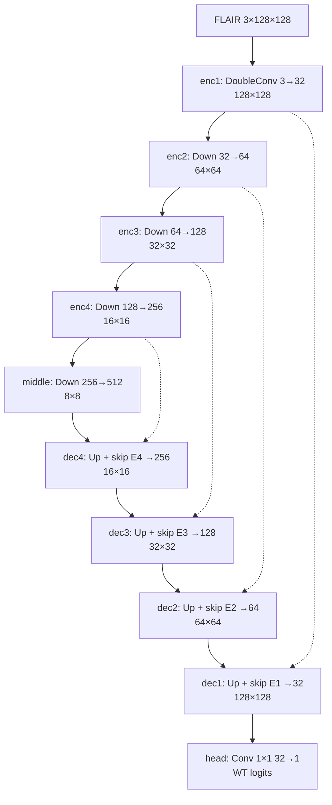

# M2 — U-Net sâu tự viết, học từ đầu

[M2.ipynb](M2.ipynb) là bản trình bày chính. Chọn kernel Windows **BraTS 2015 (.venv)** rồi **Restart Kernel + Run All**: đọc dữ liệu → xem ảnh → DataLoader → model và bảng kiến trúc → train/validation → biểu đồ, ảnh dự đoán → test. Notebook chỉ cần đổi `SEED` ở ô đầu khi chạy seed 42, 123 hoặc 2026; không dùng `ACTION` và không chờ M1/M3.

## Dữ liệu và kiến trúc

M2 dùng cùng 100 ca BraTS 2015, split 70/15/15 theo bệnh nhân, 32 lát FLAIR/ca từ 20–80% độ sâu ảnh, WT từ OT `{1,2,3,4}`, ảnh 128×128. FLAIR được chuẩn hóa median/IQR, lặp ba kênh và chuẩn hóa ImageNet; chỉ tập train mới lật ngang đồng bộ ảnh/mask.

`DoubleConv` là hai lần `Conv2d 3×3 → BatchNorm2d → ReLU`. `DownBlock` giảm kích thước bằng MaxPool, `UpBlock` nội suy rồi ghép feature map từ encoder. `ScratchUNet` được viết trực tiếp từ các lớp PyTorch cơ bản; **không dùng model dựng sẵn hay pretrained weights**.



Ô model in `torchinfo.summary`: thứ tự khối, kích thước đầu ra và số tham số. Kiểm tra bằng tensor giả cho logits `1×1×128×128`; đây chỉ là kiểm tra hình dạng, chưa phải kết quả huấn luyện.

## Train, output và đánh giá

Loss là `0.5 BCEWithLogits + 0.5 soft Dice`. Mỗi lần chạy dùng một AdamW (`lr=1e-3`, weight decay `1e-4`) và scheduler giảm learning rate; tối đa 30 epoch, dừng sớm sau ít nhất 8 epoch và 6 epoch không cải thiện. Chọn checkpoint/ngưỡng 0.30–0.70 từ Dice validation **theo bệnh nhân**, rồi đánh giá test bằng đúng checkpoint và ngưỡng đó.

Run All in loss, Dice, ngưỡng, learning rate từng epoch; bảng trung bình Dice/IoU/precision/recall/pixel accuracy của validation và test (toàn bộ, HGG, LGG); đồ thị loss/Dice và ảnh FLAIR–mask thật–mask dự đoán. Artifact ở `runs/m2/<seed>/`: `best.pt`, `history.csv`, `metrics_val.csv`, `metrics_test.csv`, `config.json`, `learning_curve.png`, `preview.png`.

**Đã có kết quả thật, seed 42:** 24 epoch; checkpoint tốt nhất epoch 18, ngưỡng 0.45. Validation 15 ca có mean Dice **0.8213**; test 15 ca có mean Dice **0.8074**, IoU **0.6910**, precision **0.8157**, recall **0.8224**, pixel accuracy **0.9923**. Notebook đã lưu log và hình để trình bày; chi tiết từng ca nằm trong CSV ở `runs/m2/42/`. Seed 123/2026 chưa có kết quả; xem [báo cáo benchmark](../Benchmark_evaluate.md) để đọc so sánh seed 42.

Chạy cùng quy trình bằng PowerShell từ root:

```powershell
& .\.venv\Scripts\python.exe .\M2\M2.py --smoke
& .\.venv\Scripts\python.exe .\M2\M2.py --train --seed 42
& .\.venv\Scripts\python.exe .\M2\M2.py --test --seed 42
```

`--smoke` chỉ kiểm pipeline bằng 2 ca train/1 ca validation, không tạo điểm benchmark. File `.py` tự chứa cùng công thức dữ liệu, model, loss và metric với notebook.
