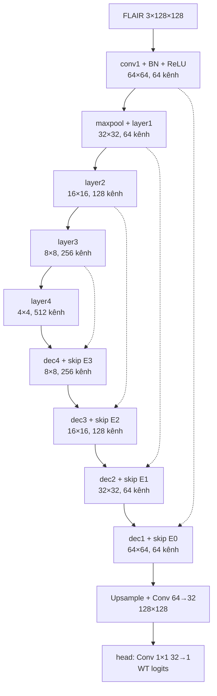

# M3 — transfer learning ResNet-18 cho whole tumor

[M3.ipynb](M3.ipynb) là bản trình bày chính. Chọn kernel Windows **BraTS 2015 (.venv)** rồi **Restart Kernel + Run All**: đọc dữ liệu → xem ảnh → DataLoader → model và bảng kiến trúc → train/validation → biểu đồ, ảnh dự đoán → test. Notebook chỉ cần đổi `SEED` ở ô đầu khi chạy seed 42, 123 hoặc 2026; không dùng `ACTION` và không chờ M1/M2.

## Dữ liệu và kiến trúc

M3 dùng cùng 100 ca BraTS 2015, split 70/15/15 theo bệnh nhân, 32 lát FLAIR/ca từ 20–80% độ sâu ảnh, WT từ OT `{1,2,3,4}`, ảnh 128×128. FLAIR được chuẩn hóa median/IQR, lặp ba kênh và chuẩn hóa ImageNet; chỉ tập train mới lật ngang đồng bộ ảnh/mask.

Encoder là `torchvision.models.resnet18` với `ResNet18_Weights.IMAGENET1K_V1` **khi train hoặc smoke**. Trong `--test`, file `.py` tạo cùng kiến trúc rồi nạp toàn bộ trọng số từ checkpoint `best.pt` đã huấn luyện; vì vậy bước test không cần tải ImageNet lại. Decoder `UpBlock` tự viết: nội suy bilinear, ghép skip rồi hai lần `Conv2d → BatchNorm2d → ReLU`. Head trả một logit WT cho mỗi pixel.



Ô model in `torchinfo.summary`: thứ tự khối, kích thước đầu ra và số tham số. Kiểm tra bằng tensor giả với encoder khởi tạo ngẫu nhiên cho logits `1×1×128×128`; đây chỉ là kiểm tra hình dạng, chưa phải kết quả huấn luyện. Run All thật sẽ tải hoặc đọc weights ImageNet từ cache `torchvision`.

## Train, output và đánh giá

Loss là `0.5 BCEWithLogits + 0.5 soft Dice`. Epoch 1–5 đóng băng encoder và giữ BatchNorm encoder ở chế độ eval; từ epoch 6 mở `layer4`. **Cùng một AdamW** xuyên suốt, với `lr=3e-4` cho decoder/head và `1e-5` cho `layer4`, weight decay `1e-4`; scheduler giảm learning rate. Tối đa 30 epoch, dừng sớm sau ít nhất 8 epoch và 6 epoch không cải thiện. Chọn checkpoint/ngưỡng 0.30–0.70 bằng Dice validation **theo bệnh nhân**, rồi test bằng đúng checkpoint/ngưỡng đó.

Run All sẽ in loss, Dice, ngưỡng, learning rate từng epoch; bảng trung bình Dice/IoU/precision/recall/pixel accuracy của validation và test (toàn bộ, HGG, LGG); đồ thị loss/Dice và ảnh FLAIR–mask thật–mask dự đoán. Artifact ở `runs/m3/<seed>/`: `best.pt`, `history.csv`, `metrics_val.csv`, `metrics_test.csv`, `config.json`, `learning_curve.png`, `preview.png`.

**Đã có artifact full seed 42:** 15 epoch; checkpoint tốt nhất epoch 9, ngưỡng 0.70. Validation 15 ca: Dice **0.8259**, IoU **0.7095**, precision **0.8473**, recall **0.8209**. Test 15 ca: Dice **0.8120**, IoU **0.6951**, precision **0.8781**, recall **0.7726**, pixel accuracy **0.9930**. `runs/m3/42/` có checkpoint, CSV và hình thật; **M3.ipynb hiện chưa lưu output của lần chạy**, nên mở notebook ở trạng thái hiện tại sẽ chưa thấy log/hình inline. Seed 123/2026 chưa có kết quả. Xem [báo cáo benchmark](../Benchmark_evaluate.md) để so sánh với M1/M2.

Chạy cùng quy trình bằng PowerShell từ root:

```powershell
& .\.venv\Scripts\python.exe .\M3\M3.py --smoke
& .\.venv\Scripts\python.exe .\M3\M3.py --train --seed 42
& .\.venv\Scripts\python.exe .\M3\M3.py --test --seed 42
```

`--smoke` chỉ kiểm pipeline bằng 2 ca train/1 ca validation, không tạo điểm benchmark. File `.py` tự chứa cùng công thức dữ liệu, model, loss và metric với notebook.
