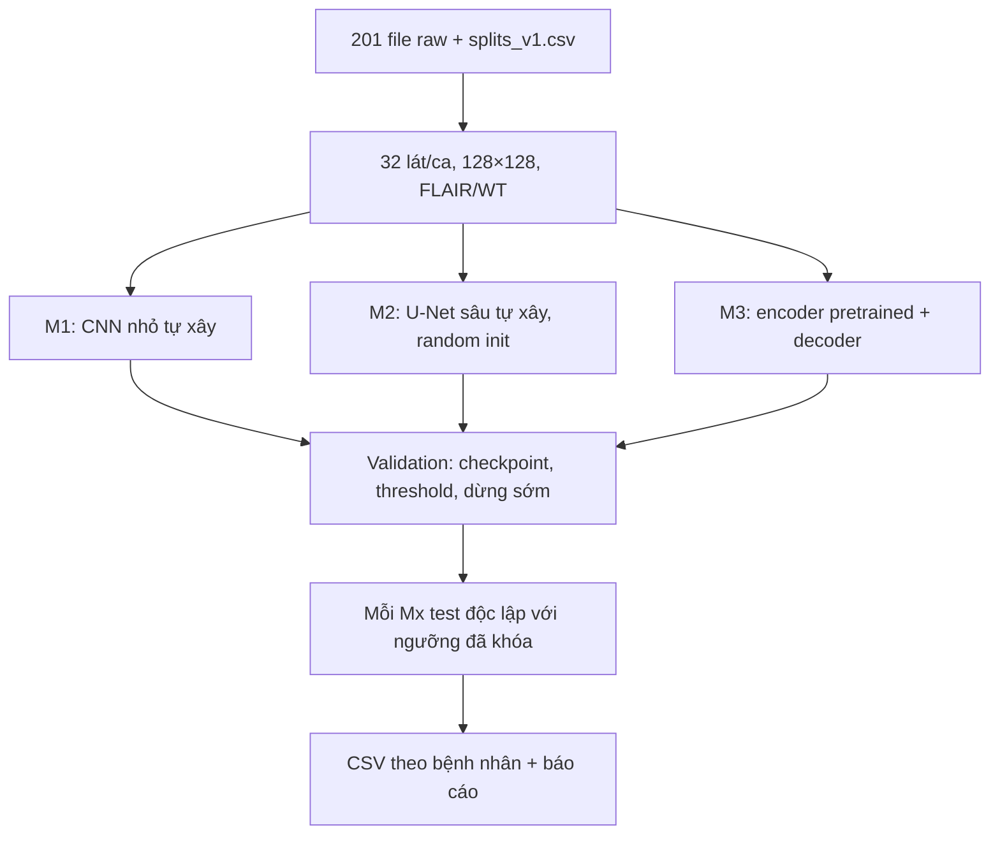
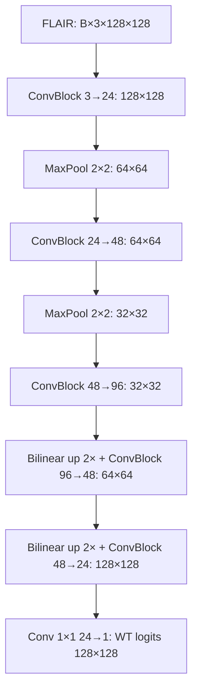
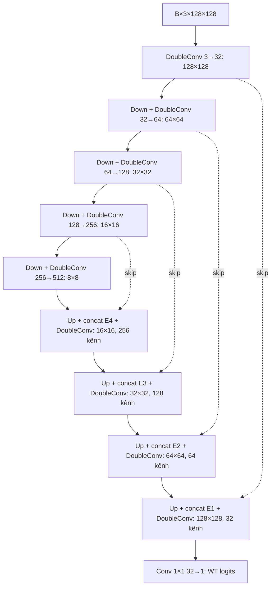
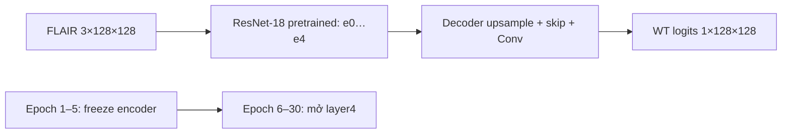

# Thiết kế Project_midterm — phân đoạn whole tumor trên BraTS 2015

## 1. Mục tiêu và dữ liệu cố định

Ba mô hình dự đoán mask **whole tumor (WT)** từ một lát MRI **FLAIR 2D**. WT = 1 khi nhãn OT thuộc `{1,2,3,4}`. Đây là phép so sánh nội bộ trên 100 ca, không phải điểm chính thức của BraTS hoặc đánh giá lâm sàng. M1 là mạng nhỏ tự xây, M2 là U-Net sâu hơn **viết toàn bộ encoder/decoder từ các lớp cơ bản và học từ đầu**, M3 là mô hình transfer learning. Vì M2 và M3 có thể khác kiến trúc, chênh lệch điểm giữa hai mô hình không chỉ phản ánh pretrained weights.

| Thành phần | Hợp đồng chung cho M1/M2/M3 |
|---|---|
| Cohort | 100 `case_id = grade/patient_id`: 80 HGG, 20 LGG; đúng `data/splits_v1.csv`. |
| Split | 70 train (56 HGG, 14 LGG), 15 validation (12, 3), 15 test (12, 3); chia theo **bệnh nhân**. |
| File | FLAIR + OT cho từng ca; xác minh 201 file trong `data/file_sha256.csv`. Raw ở `data/raw/BRATS2015/`. |
| Lát/ảnh | 32 lát/ca từ 20–80% độ sâu **ảnh**, không nhìn mask để chọn; resize 128×128, bilinear cho FLAIR và nearest cho mask. |
| Chuẩn hóa | Theo thể tích FLAIR: median/IQR của voxel khác 0, clip `[-5,5]`, đưa `[0,1]`, nền giữ 0; lặp thành 3 kênh và dùng ImageNet mean/std cho cả ba Mx. |
| Augmentation | Chỉ train: lật ngang ảnh và mask cùng lúc. |
| Loss | `0.5 BCEWithLogits + 0.5 soft Dice`; model xuất logits, sigmoid chỉ trong loss/suy luận. |
| Validation | Chọn checkpoint và threshold 0.30–0.70 theo mean Dice **theo bệnh nhân**; mỗi ca gộp đủ 32 lát. |
| Test | Mỗi Mx đánh giá **độc lập** sau khi khóa checkpoint/ngưỡng của chính mình bằng validation; Dice/IoU/precision/recall theo bệnh nhân từ TP/FP/FN. M1 còn hiển thị pixel accuracy để trình bày, nhưng Dice/IoU là metric so sánh chính. |
| Chạy cuối | CUDA, batch 16, tối đa 30 epoch, seed 42/123/2026. Ba seed đo độ ổn định của cấu hình đã chốt, không dùng để tìm optimizer. |
| Smoke | 2 ca train, 1 ca validation, 1 epoch, batch 8; chỉ kiểm pipeline, không dùng làm kết quả benchmark. |

Mask rỗng ở cả prediction và GT có Dice/IoU = 1; nếu chỉ một bên rỗng thì bằng 0. Cache chung `data/processed/flair_wt_v1/` chỉ chứa dữ liệu theo hợp đồng này. Mọi thay đổi dữ liệu, loss hoặc metric phải đồng bộ cả sáu file Mx và tài liệu trước khi chạy lại.



## 2. Kiến trúc và phạm vi so sánh

### M1 — CNN encoder–decoder nhỏ, học từ đầu

M1 không dùng model dựng sẵn, pretrained weights hay skip connection. `ConvBlock(a,b)` gồm hai lần `Conv2d(3×3, padding=1, bias=False) → BatchNorm2d → ReLU`. MaxPool 2×2 giảm kích thước; bilinear interpolation tăng kích thước. Head 1×1 cho một logit WT trên mỗi pixel.



Đây là baseline có ngữ cảnh rộng hơn CNN ba lớp cũ nhưng vẫn dễ giải thích: chỉ năm `ConvBlock`, hai lần pooling và hai lần upsample. Không có phép ghép skip; việc tái tạo biên là giới hạn cần đo bằng validation/test thật. Xem [M1/README.md](M1/README.md) để hiểu từng class/hàm và lệnh chạy.

### M2 — U-Net sâu tự viết, học từ đầu

**Đã triển khai trong M2.ipynb và M2.py:** chỉ dùng các primitive như `nn.Conv2d`, `nn.BatchNorm2d`, `nn.ReLU`, `nn.MaxPool2d`, `F.interpolate`, `torch.cat`. Viết class `DoubleConv`, `DownBlock`, `UpBlock`, `ScratchUNet` trực tiếp trong **cả notebook và `.py`**. Không gọi `torchvision.models.resnet18`, `segmentation_models_pytorch`, model U-Net dựng sẵn, `weights=None` của built-in model, hoặc tải checkpoint encoder. Toàn bộ tham số khởi tạo mới và học trên BraTS train split.



Mỗi `UpBlock` nội suy feature map sâu tới đúng kích thước skip, ghép theo chiều kênh rồi áp dụng `DoubleConv`. Việc viết các block bằng `nn.Module` và kiểm shape tại mỗi mức làm rõ kiến trúc và giúp phát hiện sai kích thước. M2 phức tạp hơn M1 ở độ sâu và skip connection, nhưng vẫn dùng **một optimizer AdamW** đã chốt, không chạy vòng thử nhiều optimizer.

### M3 — transfer learning

M3 được phép dùng `torchvision` pretrained encoder. Thiết kế hiện hành dùng ResNet-18 ImageNet weights với decoder U-Net tự viết; đầu vào vẫn là FLAIR lặp ba kênh và cùng pipeline dữ liệu. Train 5 epoch đầu với encoder frozen/BatchNorm eval, sau đó mở `layer4` và tiếp tục fine-tune đến tối đa 30 epoch. M3 hiện giữ **một AdamW xuyên suốt** bằng hai param groups; không khởi tạo lại optimizer hoặc chạy các optimizer khác để chọn điểm. Nếu đổi encoder/decoder, phải ghi kiến trúc, nguồn weights, số tham số và lịch freeze trong README và artifacts trước khi test.



So sánh M1/M2/M3 là so sánh **ba hệ thống hoàn chỉnh** trên cùng benchmark. Muốn đo riêng lợi ích pretrained, cần thí nghiệm có cùng kiến trúc và lịch train; thí nghiệm đó nằm ngoài ba Mx hiện tại.

## 3. Huấn luyện gọn và chọn mô hình

Mỗi lệnh `--train --seed ...` huấn luyện **một model, một seed, một loại optimizer**. AdamW là lựa chọn cố định cho M1/M2/M3; không có vòng lặp thử SGD, Adam, RMSprop, nhiều kiến trúc hoặc nhiều learning rate rồi train lại để chọn kết quả. Có thể giảm learning rate **trong cùng run** bằng scheduler và dừng sớm khi validation patient-level Dice không cải thiện 6 epoch liên tiếp, sau tối thiểu 8 epoch; smoke vẫn chạy đúng 1 epoch. Cả ba notebook và file `.py` đã hiện thực quy tắc này; cả ba Mx đã có artifact full seed 42. Mốc 30 epoch là trần, không phải yêu cầu chạy đủ khi đã dừng sớm.

Threshold/checkpoint chỉ được chọn trên validation. **M1 Run All** train rồi test ngay trong cùng notebook; M2/M3 cũng chỉ cần checkpoint của chính mình để test, không chờ mô hình khác. Ba seed cố định là báo độ biến thiên, không chọn seed tốt nhất để báo điểm duy nhất. Lưu `best.pt`, `history.csv`, `metrics_val.csv`, `preview.png`, `config.json` ở `runs/<mx>/<seed>/`; test tạo `metrics_test.csv`. Báo cáo tổng hợp sau này đọc CSV đã lưu từ từng Mx. Không tinh chỉnh lại bằng test hoặc suy diễn kiến trúc sâu hơn chắc chắn có điểm cao hơn trước phép đo.

## 4. Cấu trúc repository và trạng thái thật

```text
Project_midterm/
├── AGENTS.md, README.md, Project_structure.md, Detail_jobs.md, Benchmark_evaluate.md
├── requirements.txt, .venv/                 # .venv Windows; không commit
├── M1/M1.ipynb, M1/M1.py, M1/README.md
├── M2/M2.ipynb, M2/M2.py, M2/README.md
├── M3/M3.ipynb, M3/M3.py, M3/README.md
├── data/source_manifest.json, splits_v1.csv, file_sha256.csv
├── data/raw/BRATS2015/, data/processed/flair_wt_v1/
├── runs/, reports/
└── slides/                                  # tài liệu người dùng, giữ nguyên
```

Notebook là cách trình bày/chạy chính, chứa đủ code và Markdown; `.py` trong cùng Mx tự chứa quy trình tương ứng. Không import code từ Mx khác, không thêm `scripts/`, `src/` hay package nội bộ. Chạy trên **Windows `.venv` và CUDA**, không dùng kernel WSL.

**Trạng thái chuyển đổi:** 201/201 file raw đã được xác minh, cache có 100 ca. Seed 42 của cả ba Mx đã có artifact full train + test Windows/CUDA: M1 dừng epoch 26, best epoch 20, validation/test Dice **0.8027/0.7997**; M2 dừng epoch 24, best epoch 18, **0.8213/0.8074**; M3 dừng epoch 15, best epoch 9, **0.8259/0.8120**. Mỗi test có 15 bệnh nhân; M3 notebook chưa lưu output dù artifact đã có trong `runs/m3/42/`. Seed 123/2026 chưa có kết quả. Xem [Benchmark_evaluate.md](Benchmark_evaluate.md) để đọc so sánh và giới hạn.
