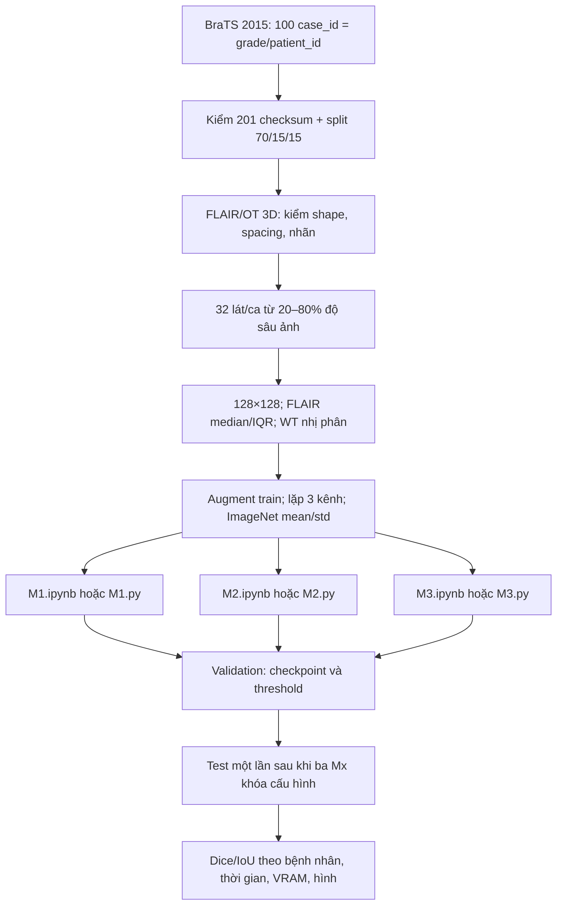
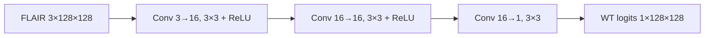
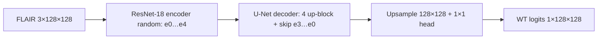
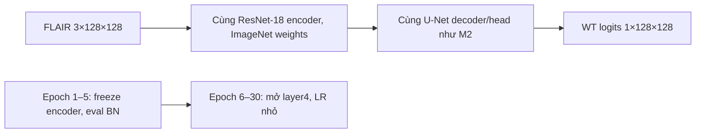

# Thiết kế project — ba mô hình, một benchmark BraTS 2015

## 1. Bài toán và nguồn dữ liệu

Nhóm phân đoạn nhị phân **whole tumor (WT)** trên MRI **FLAIR 2D**. Mask OT có nhãn `{0,1,2,3,4}`; WT = 1 nếu nhãn thuộc `{1,2,3,4}`, còn 0 là nền. Ba Mx giải đúng một bài toán trên đúng một cohort, không so sánh các dataset khác nhau. Đây là benchmark nội bộ trên tập con, không phải kết quả BraTS chính thức hay đánh giá lâm sàng.

- [Academic Torrents BraTS 2015](https://academictorrents.com/details/c4f39a0a8e46e8d2174b8a8a81b9887150f44d50) là nguồn metadata/torrent. [Baidu AI Studio](https://aistudio.baidu.com/datasetdetail/26367) là nguồn tham khảo thay thế; không trộn file của hai nguồn nếu chưa đối chiếu checksum.
- Gói torrent gốc khoảng 5,34 GB/1.812 file. Web seed HTTPS [Archive.org](https://archive.org/metadata/BRATS2015) chỉ có 100 HGG và 54 LGG training case hoàn chỉnh có FLAIR/OT. Cohort đã khóa chọn 80 HGG + 20 LGG, 200 file `.mha` khoảng **0,870 GiB**, cùng file giấy phép CC BY-NC-SA 3.0.
- `data/source_manifest.json` ghi case/file/SHA-1 nguồn; `data/splits_v1.csv` ghi split; `data/file_sha256.csv` ghi SHA-256 201 file. **Ngày 28/09/2026 đã kiểm tra đủ 201/201 file trên máy này**, vì vậy không tải lại. Lệnh PowerShell tải trên máy khác và kiểm checksum nằm trong [README.md](README.md).



## 2. Repository và quy tắc mã tự chứa

```text
Project_midterm/
├── AGENTS.md                    # quy tắc cho mọi chat session/agent
├── README.md                    # cài đặt, download, chạy notebook/PowerShell
├── Project_structure.md         # thiết kế này
├── Detail_jobs.md               # 1 Mx / 1 thành viên, checklist
├── requirements.txt             # package pip bên ngoài
├── .venv/                       # chỉ Python Windows, không commit
├── M1/M1.ipynb, M1/M1.py, M1/README.md
├── M2/M2.ipynb, M2/M2.py, M2/README.md
├── M3/M3.ipynb, M3/M3.py, M3/README.md
├── data/
│   ├── source_manifest.json, splits_v1.csv, file_sha256.csv
│   ├── raw/BRATS2015/          # 200 MRI + giấy phép, không commit
│   └── processed/flair_wt_v1/ # cache đồng nhất, không commit
├── runs/                       # smoke/full checkpoint, metric, preview
├── reports/                    # bảng và báo cáo nhóm
└── slides/                     # tài liệu do người dùng cung cấp
```

Mỗi `.ipynb` chứa **mã đầy đủ ngay trong các cell** và Markdown giải thích. `.py` cùng folder chứa quy trình tương ứng để chạy PowerShell. Không có `scripts/`, `src/`, `configs/`, notebook chung, package hay import mã giữa Mx. Chỉ `data/` và `.venv` là tài nguyên chung. Vì có sáu bản mã tự chứa, thay preprocessing, loss, metric hoặc kiến trúc M2/M3 phải đồng bộ cả sáu file trước benchmark cuối; `AGENTS.md` quy định việc này.

## 3. Kiến trúc từng mức

### M1 — mạng nơ ron đơn giản



Baseline học từ đầu, receptive field nhỏ và không downsample. Mục tiêu là mốc đơn giản, không nhận là tái hiện đầy đủ FCN của [Long và cộng sự](https://openaccess.thecvf.com/content_cvpr_2015/html/Long_Fully_Convolutional_Networks_2015_CVPR_paper.html).

### M2 — mạng phức tạp huấn luyện từ đầu



Mã U-Net dùng `torchvision.models.resnet18(weights=None)`, decoder tự viết trong **M2.ipynb/M2.py**. Cấu trúc dựa trên [U-Net](https://arxiv.org/abs/1505.04597) và [ResNet](https://openaccess.thecvf.com/content_cvpr_2016/html/He_Deep_Residual_Learning_CVPR_2016_paper.html).

### M3 — transfer learning/fine-tune



`ResidualUNet` và decoder được viết trực tiếp, giống nhau trong **M2 và M3**. M3 dùng `ResNet18_Weights.IMAGENET1K_V1`; 5 epoch đầu chỉ học decoder/head, 25 epoch sau thêm `encoder.layer4`. So sánh M2/M3 phản ánh cả pretrained weights **và lịch train khác**, không quy toàn bộ chênh lệch cho weights. Nguồn đọc: [PyTorch transfer learning](https://docs.pytorch.org/tutorials/beginner/transfer_learning_tutorial.html) và [torchvision ResNet-18](https://docs.pytorch.org/vision/main/models/generated/torchvision.models.resnet18).

## 4. Hợp đồng benchmark và đánh giá

| Thành phần | Quy tắc chung |
|---|---|
| Khóa ca | `case_id = grade/patient_id`; 100 ca, 80 HGG/20 LGG. Không dùng `patient_id` trần vì có thể trùng giữa grade. |
| Split | 70 train (56 HGG/14 LGG), 15 val (12/3), 15 test (12/3), khóa trong `splits_v1.csv`. Mỗi lát của một ca ở cùng split. |
| Lát/ảnh | 32 lát/ca từ 20–80% độ sâu **ảnh** bằng chỉ số cố định; 128×128; bilinear cho FLAIR, nearest cho mask. Không dùng mask để chọn lát. |
| Chuẩn hóa | Theo mỗi thể tích: median/IQR voxel FLAIR khác 0, clip `[-5,5]`, đưa `[0,1]`, giữ nền 0. Lặp FLAIR thành 3 kênh rồi ImageNet mean/std cho cả ba. |
| Augmentation | Chỉ train: lật ngang đồng bộ ảnh/mask. Val/test không augmentation. |
| Huấn luyện | Batch 16 full (8 smoke), tối đa 30 epoch; AdamW; CUDA AMP; loss `0.5 BCEWithLogits + 0.5 soft Dice`; seed 42, 123, 2026. |
| Chọn model | Trong mỗi epoch, chọn threshold 0.30–0.70 và checkpoint theo **mean Dice theo bệnh nhân trên validation**. Không xem test khi chọn. |
| Test | Chỉ sau khi cả ba Mx có checkpoint full cho seed; Dice/IoU/precision/recall theo ca từ TP/FP/FN của đủ 32 lát. Hai mask cùng rỗng có Dice/IoU = 1; nếu chỉ một rỗng = 0. |
| Smoke | 2 train case, 1 val case, 1 epoch, ghi `runs/smoke/`; chỉ kiểm tính chạy được, không phải benchmark. |

Mỗi file Mx tự kiểm 201 checksum, split và CUDA trước khi chạy. Cache tiền xử lý ở `data/processed/flair_wt_v1/` chỉ phụ thuộc hợp đồng dữ liệu; sửa preprocessing phải đổi cache version ở **cả sáu file**. Test theo bệnh nhân với 15 ca có bất định lớn; báo cáo cuối nên kèm điểm từng ca, trung bình/độ lệch chuẩn và bootstrap theo `case_id` sau khi chạy đủ seed.

## 5. Phần cứng, trạng thái và rủi ro thực nghiệm

Máy đã nhận i7-12800H, RTX A4500 Laptop **16 GiB VRAM**, khoảng 23 GiB RAM; `.venv` tại root là **Python Windows 3.12**. Ảnh 128×128 và batch 16 được thiết kế cho cấu hình này; phải đo peak VRAM/tốc độ thật khi smoke và full, không coi dự toán là kết quả. Dự toán trước khi có PyTorch Windows là M1 2–10 phút/seed, M2 15–50 phút/seed, M3 12–45 phút/seed; tổng 3 seed × 3 Mx khoảng 1,5–5,5 giờ GPU, có thể thay đổi theo nhiệt, I/O và phiên bản package.

**Trạng thái:** dữ liệu đã kiểm đủ 201/201; cache đã tạo cho 100/100 ca; ba `.py` và ba notebook đã chạy smoke thành công trên Windows `.venv`/CUDA. Cặp code notebook–`.py` của từng Mx được đối chiếu khớp; M2/M3 có cùng đoạn class model và cùng số tham số. Kết quả full 3 seed, test và báo cáo benchmark chỉ được ghi khi đã chạy thật. Các notebook mặc định smoke để người đọc kiểm từng mức từ clean kernel mà không vô tình chạy nhiều giờ.
