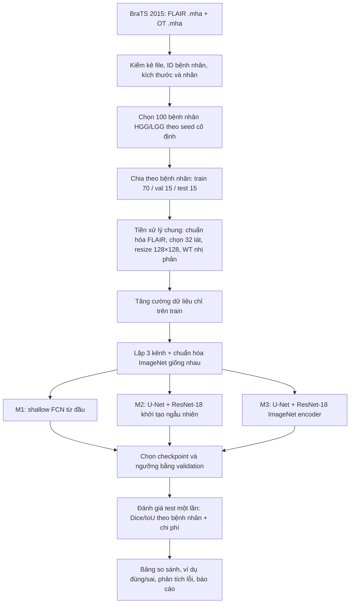
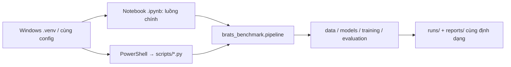
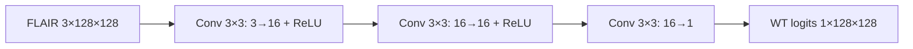
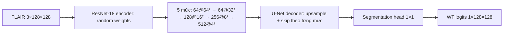
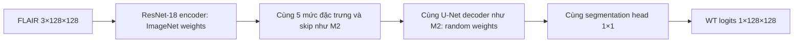

# Đề cương project Computer Vision: phân đoạn u não trên MRI BraTS 2015

> **Ngày lập đề cương:** 27/09/2026
>
> **Bài toán:** phân đoạn nhị phân *whole tumor* (WT) trên lát cắt MRI FLAIR 2D.
>
> **Ba mức yêu cầu:** M1 = mạng nơ ron đơn giản; M2 = mạng sâu phức tạp hơn; M3 = transfer learning và fine-tuning.
> **Nguyên tắc benchmark:** một tập bệnh nhân, một định nghĩa nhãn, một cách chia dữ liệu, một giao thức đánh giá cho cả ba mô hình.

## 1. Quyết định về dataset

Hai liên kết được đề xuất cùng nói về **BraTS 2015**, không phải hai dataset độc lập:

| Nguồn | Kết quả kiểm tra | Cách dùng trong project |
|---|---|---|
| [Academic Torrents – BraTS 2015](https://academictorrents.com/details/c4f39a0a8e46e8d2174b8a8a81b9887150f44d50) | Trang công bố gói **5,34 GB**, **1.812 file**, có thư mục `training/HGG`, `training/LGG`, MRI `.mha` và mask `OT`; metadata liệt kê nhãn 0–4. Torrent ghi web seed Archive.org. | **Nguồn chuẩn ưu tiên**. `scripts/download_dataset.py` xác minh infohash rồi tải 100 cặp FLAIR–OT qua HTTPS từ web seed, không cần tải gói đầy đủ. |
| [Baidu AI Studio – BraTS2015](https://aistudio.baidu.com/datasetdetail/26367) | Trang xác nhận tên **BraTS2015**. Danh sách file, kích thước, phiên bản và điều kiện tải không hiện rõ khi truy cập công khai. | Nguồn tải thay thế nếu Academic Torrents khó tải; kiểm tra lại cấu trúc và danh tính ca bệnh trước khi dùng. |

**Đánh giá:** dataset phù hợp với yêu cầu M1–M3 vì có ảnh và mask phân đoạn cho cùng một tác vụ. Bản đầy đủ không thuộc loại rất nhẹ. Benchmark chính dùng **100 ca có nhãn từ thư mục `training`**, chỉ lấy **FLAIR + OT**, xử lý thành 32 lát 128×128/ca. Bản sao HTTPS Archive.org chỉ có **100 HGG và 54 LGG hoàn chỉnh** trong phần training; chọn từ các ca này sau khi khớp path và kích thước với torrent gốc. Metadata cho thấy 200 file MRI được chọn có tổng **0,870 GiB**, cộng file giấy phép rất nhỏ. Đường tải thật là `data/raw/BRATS2015/training/{HGG,LGG}/<patient_id>/...`; `data/source_manifest.json` khóa danh sách ca và `data/splits_v1.csv` khóa split. Với Baidu, nếu chỉ có một archive, có thể phải tải toàn bộ rồi mới lọc; chỉ dùng làm nguồn thay thế sau khi đối chiếu file.

**Không trộn hai bản tải một cách mặc định.** Nguồn thực nghiệm hiện chọn là Academic Torrents/web seed Archive.org; nếu chuyển nguồn, đối chiếu `case_id`, kích thước ảnh, mask và checksum của file trùng tên. Script xác minh infohash torrent `c4f39a0a8e46e8d2174b8a8a81b9887150f44d50`, ghi provenance vào manifest và kiểm tra kích thước/SHA-1 gốc/header `.mha`. Sau khi tải đủ, `verify_dataset.py --write-checksums` đã tạo `data/file_sha256.csv`; kết quả **201/201 file hợp lệ** trên máy này. Torrent có file giấy phép CC BY-NC-SA 3.0; không đưa ảnh gốc lên Git.

### Giới hạn của benchmark

Đây là **benchmark nội bộ trên tập con BraTS 2015**, không phải điểm số chính thức của thử thách BraTS. Bài toán chỉ xét WT trên FLAIR và 32 lát cắt được chọn; không suy diễn thành hiệu năng phân đoạn đa lớp, đa modality hoặc toàn bộ thể tích 3D. Không dùng tập `testing` của bản phát hành nếu không có mask thật.

### Máy hiện tại và tính khả thi

Kiểm tra phần cứng ngày **27/09/2026**: CPU **Intel Core i7-12800H** (20 luồng), khoảng **23 GiB RAM** khả dụng trong phiên kiểm tra, GPU **NVIDIA RTX A4500 Laptop 16 GiB VRAM**, ổ D: còn khoảng **202 GiB**. **PowerShell Windows 5.1 và Python Windows 3.12** có sẵn; `.venv` đã được tạo bằng Python Windows. PyTorch, torchvision, SimpleITK, ipykernel hiện chưa cài trong `.venv`, nên chưa có số đo train/inference thật trên Windows.

Với split 70 train / 15 validation / 15 test, mỗi ca 32 lát: **2.240 lát train**, **480 lát validation**, **480 lát test**. Batch hiệu dụng 16 tương ứng **140 train step/epoch**; 30 epoch tối đa = **4.200 train step cho một seed và một mô hình**. Cấu hình máy **phù hợp** cho cả ba mô hình 2D ở 128×128, nhất là khi dùng mixed precision. Batch 16 là mục tiêu cần kiểm tra bằng profiler; không cam kết fit trước khi đo peak VRAM.

| Mức | Ước lượng train 1 seed | Ước lượng train 3 seed | Ước lượng inference 32 lát/ca trên GPU, không tính I/O |
|---|---:|---:|---:|
| M1 | 2–10 phút | 6–30 phút | dưới 0,5 giây |
| M2 | 15–50 phút | 45–150 phút | khoảng 0,2–2 giây |
| M3 | 12–45 phút | 36–135 phút | khoảng 0,2–2 giây |

**Tổng lịch cuối:** khoảng **1,5–5,5 giờ GPU** cho 3 mô hình × 3 seed, sau khi dữ liệu đã sẵn sàng. Đây là dải **ước lượng để lên kế hoạch**, có thể sai nếu GPU đang bận, laptop giảm xung do nhiệt, batch/augmentation thay đổi hoặc tốc độ đọc file thấp. Không tính thời gian tải tập con 0,870 GiB, cài môi trường, tiền xử lý và làm báo cáo. Dùng profiler chạy bằng **PowerShell/Python Windows** để thay thế ước lượng trước khi train cuối. Không tạo hoặc dùng môi trường Python bằng WSL cho project này.

## 2. Câu hỏi nghiên cứu và mục tiêu

**Câu hỏi:** Trên cùng tập MRI FLAIR và cùng ngân sách huấn luyện, mạng CNN đơn giản, U-Net huấn luyện từ đầu và U-Net dùng encoder tiền huấn luyện khác nhau thế nào về chất lượng phân đoạn WT, thời gian và tài nguyên?

**Đầu vào:** một lát cắt FLAIR 2D kích thước 128×128.

**Đầu ra:** bản đồ xác suất u cùng kích thước; nhị phân hóa bằng ngưỡng chọn trên validation.

**Nhãn:** `WT = 1` nếu giá trị mask OT thuộc `{1, 2, 3, 4}`, ngược lại `0`. Trên trang dữ liệu, 1 = necrosis, 2 = edema, 3 = non-enhancing tumor, 4 = enhancing tumor.
**Sản phẩm cuối:** bảng benchmark M1/M2/M3, ảnh chồng mask dự đoán, đồ thị huấn luyện, mã tái lập thí nghiệm, báo cáo và slide.

## 3. Sơ đồ kiến trúc tổng thể



**Hai cách chạy trên cùng mã nguồn:**



Notebook chỉ điều phối, trình bày EDA/ảnh/biểu đồ và diễn giải; script là entry point PowerShell để chạy lại. Không có hai bộ xử lý dữ liệu hay hai hàm metric riêng. Cài package `src/brats_benchmark` ở chế độ editable trong **Windows `.venv`** để notebook import từ bất kỳ thư mục M1/M2/M3 mà không sửa `sys.path`.

### Nguyên tắc kiến trúc chung

Mọi mô hình nhận **chính xác cùng tensor** FLAIR `3×128×128` (một chuỗi MRI lặp ba kênh, cùng chuẩn hóa) và trả về **một** bản đồ logits WT `1×128×128`. Không áp sigmoid trong tầng cuối khi tính BCEWithLogitsLoss. M1 đo năng lực mạng nông; M2 và M3 dùng **cùng U-Net/ResNet-18 và decoder**, khác nhau ở trọng số khởi tạo encoder và lịch fine-tune. Vì thế, M2–M3 là phép đối chứng có kiểm soát tốt hơn cho transfer learning.

| Mức | Khởi tạo | Số tầng/đường đi chính | Huấn luyện |
|---|---|---|---|
| **M1 — simple neural network** | Toàn bộ ngẫu nhiên | CNN nông 3 Conv 3×3, không downsampling/skip | Học toàn bộ mạng từ đầu. |
| **M2 — complex neural network** | Toàn bộ ngẫu nhiên | U-Net 2D, encoder ResNet-18 5 mức đặc trưng + decoder có skip | Học toàn bộ encoder/decoder/head từ đầu. |
| **M3 — transfer learning / fine-tune** | Encoder ImageNet; decoder/head ngẫu nhiên | **Đúng kiến trúc, decoder và số tham số của M2** | 5 epoch học decoder/head khi encoder đóng băng; 25 epoch mở `layer4` để fine-tune. |

#### M1: CNN nông



Dùng padding 1 cho ba convolution để giữ kích thước. Receptive field nhỏ tạo baseline đơn giản và nhanh; không kỳ vọng M1 nắm được ngữ cảnh lớn như U-Net.

#### M2: U-Net/ResNet-18 khởi tạo ngẫu nhiên



Cấu hình dự kiến: `smp.Unet(encoder_name="resnet18", encoder_weights=None, in_channels=3, classes=1, activation=None)`. Ghi rõ `encoder_depth` và `decoder_channels` trong config; M3 phải dùng **cùng giá trị**.

#### M3: cùng U-Net/ResNet-18 với encoder ImageNet



Cấu hình chỉ đổi `encoder_weights="imagenet"`; không dùng thêm modality. Lịch học hai pha: **pha A, 5 epoch** đóng băng encoder và học decoder/head; **pha B, 25 epoch** mở `layer4` với learning rate nhỏ, tiếp tục học decoder/head. Khi đóng băng, đặt BatchNorm encoder ở chế độ eval để không cập nhật running statistics. Quy tắc chuyển pha và các lớp mở khóa lưu trong config và log.

> M2–M3 có cùng kiến trúc nhưng lịch học khác nhau vì pha đóng băng là một phần của phương pháp transfer learning. Báo cáo nêu rõ điều này; không diễn giải toàn bộ chênh lệch điểm số là do pretrained weights riêng lẻ.

## 4. Giao thức dữ liệu để so sánh công bằng

1. **Kiểm kê trước khi chọn:** từ metadata torrent và file tải về, xác nhận mỗi ca trong `training/HGG` và `training/LGG` có đúng một FLAIR và một OT đọc được, cùng shape/spacing/orientation, mask chỉ chứa `{0,1,2,3,4}`. Loại ca hỏng bằng tiêu chí công bố trước và lưu `data/excluded_cases.csv`. Không lấy file từ `testing` khi đánh giá vì không có mask thật.
2. **Định danh ca:** `patient_id` có thể trùng giữa HGG và LGG; khóa duy nhất là **`case_id = grade/patient_id`**. Đầu tiên, lọc các ca có cả FLAIR/OT trong [inventory Archive.org](https://archive.org/metadata/BRATS2015) và có path/kích thước trùng metadata torrent đã xác minh; lưu SHA-1 gốc của từng file. Trong từng nhóm còn lại, sắp ID theo SHA-256 của `"brats2015-light-v1:" + patient_id`, lấy **80 HGG và 20 LGG**. `data/source_manifest.json` khóa tập chọn này (`selection_version = archive-webseed-v2`), nên mirror cập nhật không làm thay đổi benchmark khi chạy lại.
3. **Chia tập một lần:** trong từng nhóm, sắp 100 ca đã chọn bằng SHA-256 của `"brats2015-split-v1:" + case_id`; HGG = **56 train / 12 val / 12 test**, LGG = **14 / 3 / 3**, tổng **70 / 15 / 15 ca**. `data/splits_v1.csv` đã được tạo với `case_id`, `grade`, `patient_id`, `split`, đường dẫn tương đối FLAIR/OT và kích thước kỳ vọng. Mọi mô hình dùng đúng file này. `data/file_sha256.csv` ghi checksum sau khi tải đủ file.
4. **Lát cắt:** đọc `.mha` theo trục xuất ra bởi thư viện (ghi trục thực tế trong manifest); chọn 32 chỉ số phân bố đều từ **20% đến 80% độ sâu** mỗi thể tích, xác định chỉ từ shape ảnh, không dùng mask để chọn lát. Sau đó resize ảnh 128×128 bằng bilinear và mask bằng nearest-neighbor. Phạm vi đánh giá chỉ gồm các lát đã chọn. Giữ cả lát không có u; thống kê tỉ lệ lát có/không có u cho từng split.
5. **Chuẩn hóa ảnh gốc:** với mỗi thể tích FLAIR, tính median và IQR trên voxel khác 0; chuẩn hóa `(x - median) / max(IQR, ε)`, clip vào `[-5, 5]`, đưa về `[0,1]`, giữ nền ngoài não bằng 0. Thống kê này lấy từ chính ảnh, không từ label và không tính chung trên test.
6. **Tăng cường chỉ trên train:** lật trái/phải, xoay nhỏ (ví dụ ±10°), thay đổi cường độ nhẹ **trên ảnh `[0,1]`**; cùng policy và xác suất cho M1/M2/M3, đồng bộ biến đổi hình học giữa ảnh và mask. Validation/test không augmentation.
7. **Tạo tensor đầu vào:** sau augmentation, lặp ảnh FLAIR sang 3 kênh rồi áp dụng cùng mean/std ImageNet cho **M1, M2 và M3**; bảo đảm tensor đầu vào giống nhau ở cả ba mô hình. Mask vẫn là một kênh nhị phân.
8. **Kiểm tra rò rỉ:** kiểm tra giao `case_id` giữa ba tập là rỗng, phát hiện file trùng checksum và ảnh trùng/near-duplicate giữa các tập, xác nhận mọi lát của một ca ở cùng split. Không chọn ngưỡng, checkpoint hay siêu tham số bằng test.

> **Lưu ý kỹ thuật:** vì chỉ có 15 ca test, điểm số có thể dao động đáng kể theo cách chọn bệnh nhân. Báo cáo điểm theo từng ca và khoảng tin cậy bootstrap theo **bệnh nhân**, đồng thời nêu rõ quy mô tập con; không xem đây là kết luận lâm sàng.

## 5. Huấn luyện và lựa chọn mô hình

| Thành phần | Cấu hình chung / quy tắc |
|---|---|
| Framework | Python, PyTorch, SimpleITK để đọc `.mha`; `segmentation_models_pytorch` cho M2/M3 hoặc triển khai tương đương có khai báo phiên bản. |
| Loss | `0.5 × BCEWithLogitsLoss + 0.5 × soft Dice loss`, tính trên toàn bộ pixel. BCE nhận trực tiếp logits; soft Dice áp `sigmoid` **bên trong loss**. Khi suy luận, áp sigmoid rồi ngưỡng hóa. Cùng loss cho cả ba. |
| Optimizer và precision | AdamW, batch size hiệu dụng mục tiêu 16, tối đa **30 epoch**; dùng CUDA mixed precision (`torch.autocast` + `torch.amp.GradScaler`) và ghi dtype thực tế. Ghi learning rate, weight decay, lịch điều chỉnh và batch size thực chạy trong `configs/`. Nếu thiếu VRAM, giảm batch đồng nhất cho **cả ba** hoặc dùng gradient accumulation để giữ batch hiệu dụng. |
| M1/M2 | Huấn luyện từ đầu; learning rate khởi điểm `1e-3`. Cùng lịch tối đa 30 epoch. M2 dùng cùng factory U-Net/ResNet-18 như M3 nhưng `encoder_weights=None`. Với mỗi seed, khởi tạo decoder/head của M2 và M3 bằng cùng giá trị để giảm nhiễu khi so sánh. |
| M3 | Tổng tối đa 30 epoch: **5 epoch** đóng băng encoder, học decoder/head ở `1e-3`; **25 epoch** mở `layer4`, dùng `1e-5` cho phần encoder mở và `1e-4` cho decoder/head. Các BatchNorm của phần encoder đóng băng phải ở chế độ eval; nêu rõ cách xử lý BatchNorm khi fine-tune. |
| Chọn checkpoint | Sau mỗi epoch, đánh giá **mean Dice theo bệnh nhân trên validation** ở ngưỡng cố định 0,5; chọn checkpoint cao nhất, tie-break bằng validation loss. Early stopping sau 7 epoch không cải thiện, nhưng M3 chỉ xét dừng sớm ở giai đoạn 2. |
| Chọn ngưỡng | Sau khi chọn checkpoint, thử `0.30, 0.35, …, 0.70` trên validation; chọn ngưỡng tối đa mean Dice, nếu hòa chọn giá trị gần 0,5 nhất. Lưu ngưỡng riêng cho từng mô hình, rồi khóa trước khi mở test. |
| Tái lập | Cố định split và chạy **3 seed** khởi tạo/augmentation `42, 123, 2026` cho mỗi mô hình. Dùng cùng seed tương ứng khi so sánh. Lưu config, phiên bản package, GPU/CPU, commit code, checkpoint và log. |

Nếu cần giảm thời gian, chạy trước một vòng pilot để phát hiện lỗi pipeline; **không dùng kết quả pilot để báo cáo benchmark cuối**. Bộ kết quả cuối giữ cùng giao thức trên và ghi đầy đủ nếu tài nguyên buộc phải thay đổi kế hoạch.

### Đo thời gian thật trước khi train đầy đủ

1. Dùng Windows `.venv`; cài PyTorch CUDA theo [bộ chọn chính thức Windows/Pip/CUDA](https://docs.pytorch.org/get-started/locally/). Xác nhận `torch.cuda.is_available()` và `nvidia-smi` nhìn cùng GPU. Không ước lượng hiệu năng chỉ từ tên GPU.
2. Dùng **M2** làm bài đo tài nguyên vì M2 train toàn bộ U-Net/ResNet-18. Thử batch 16 và AMP; chạy 20 batch warm-up, rồi đo 100 batch train với CUDA synchronize trước/sau phép đo. Đo riêng một epoch validation, thời gian preprocess/cache và peak VRAM. Chạy thêm 100 batch inference batch 1 để đo ms/lát.
3. Tính `T_epoch ≈ ceil(2240 / batch hiệu dụng) × thời gian train step + thời gian validation epoch`; suy ra `T_run ≈ T_epoch × số epoch thực chạy + thời gian checkpoint`. M3 được đo riêng cho pha đóng băng và pha fine-tune vì tốc độ khác nhau. Ghi kết quả vào `reports/hardware_profile.md` cùng phiên bản thư viện, GPU load và chế độ nguồn điện.
4. Nếu peak VRAM quá cao: thử batch 8 với accumulation 2; giữ batch hiệu dụng 16 cho cả ba. Nếu đọc nhiều file nhỏ chậm, tạo một cache đã xử lý hiệu quả hơn trong `data/processed/` trên ổ Windows và đo lại. Không chuyển môi trường hoặc cache sang WSL.

Việc dùng AMP tuân theo [ví dụ chính thức của PyTorch](https://docs.pytorch.org/docs/main/notes/amp_examples.html). Khi đo inference, đặt `eval()` và `torch.inference_mode()`, warm-up, synchronize CUDA và tách thời gian model khỏi đọc `.mha`/tiền xử lý.

## 6. Đánh giá và trình bày kết quả

**Metric chính:** Dice WT theo bệnh nhân, tính từ tổng TP/FP/FN của **toàn bộ 32 lát được chọn cho ca đó**: `Dice = 2TP / (2TP + FP + FN)`. Báo cáo trung bình và độ lệch chuẩn trên 15 bệnh nhân test, theo từng seed và trung bình 3 seed. **Metric phụ:** IoU WT `= TP/(TP+FP+FN)`, precision, recall; tính cùng cách theo bệnh nhân. Trường hợp mask thật và dự đoán cùng rỗng được quy ước Dice/IoU = 1; nếu chỉ một bên rỗng thì = 0. Ghi riêng số ca/lát rỗng để không làm điểm số trông cao giả.

**Độ bất định:** bootstrap 1.000 lần trên **`case_id`** để lấy khoảng tin cậy 95% cho mean Dice (có thể gộp seed bằng trung bình mỗi ca trước bootstrap). Nêu giới hạn do test chỉ có 15 ca. Báo cáo kết quả HGG/LGG chỉ như phân tích mô tả vì nhóm LGG test có 3 ca.

**Chi phí:** số tham số và tham số trainable, thời gian huấn luyện trên cùng phần cứng, thời gian suy luận trung bình mỗi lát với batch size 1 sau warm-up, peak GPU memory nếu có. Với CPU, ghi model máy và RAM; không so sánh latency chạy trên thiết bị khác nhau.

**Bảng bắt buộc trong báo cáo:**

| Model | Val Dice | Test Dice WT ↑ | Test IoU WT ↑ | Precision ↑ | Recall ↑ | Params | Train time | Inference ms/lát |
|---|---:|---:|---:|---:|---:|---:|---:|---:|
| M1 – shallow FCN | đo sau khi chạy |  |  |  |  |  |  |  |
| M2 – U-Net/ResNet-18 scratch | đo sau khi chạy |  |  |  |  |  |  |  |
| M3 – cùng U-Net/ResNet-18 pretrained | đo sau khi chạy |  |  |  |  |  |  |  |

Không điền điểm dự đoán trước khi chạy. Có thêm bảng chi tiết theo seed, ID bệnh nhân và khoảng tin cậy. Vẽ loss/Dice theo epoch, histogram Dice theo bệnh nhân, ít nhất 3 ca: tốt, trung bình, thất bại; mỗi hình gồm FLAIR, mask thật, mask M1/M2/M3 và overlay. Phân tích lỗi tại rìa u, vùng phù rộng, u nhỏ, lát ít tín hiệu; kiểm tra cả false positive trên lát không có u.

## 7. Cấu trúc repository và hợp đồng chạy

```text
Project_midterm/
├── AGENTS.md                       # Quy tắc Windows + notebook/PowerShell + benchmark
├── README.md                       # Cách dùng và lệnh tải dataset đã thử
├── Project_structure.md            # Giao thức, kiến trúc và metric
├── Detail_jobs.md                  # 1 Mx / 1 thành viên, đầu ra và mốc bàn giao
├── pyproject.toml                  # Package src-layout, cài editable
├── requirements.txt                # Phụ thuộc ngoài torch/torchvision CUDA
├── .gitignore                      # Bỏ qua .venv, MRI, cache, checkpoint
├── .gitattributes                  # Chuẩn hóa line endings
├── .venv/                         # Tạo bằng Python Windows; không commit
├── configs/
│   ├── benchmark.yaml              # Dataset/split/metric/seed dùng chung
│   ├── m1.yaml                     # CNN nông
│   ├── m2.yaml                     # U-Net/ResNet-18 random
│   └── m3.yaml                     # Cùng U-Net, ImageNet + hai pha fine-tune
├── notebooks/
│   ├── 00_prepare.ipynb            # Notebook dữ liệu, EDA; thành viên 1
│   └── 90_compare.ipynb            # Notebook báo cáo benchmark; thành viên 3
├── M1/
│   ├── README.md                   # Giải thích, hình và kết quả M1
│   └── M1.ipynb                    # Notebook chính của thành viên 1
├── M2/
│   ├── README.md                   # Giải thích, hình và kết quả M2
│   └── M2.ipynb                    # Notebook chính của thành viên 2
├── M3/
│   ├── README.md                   # Giải thích, hình và kết quả M3
│   └── M3.ipynb                    # Notebook chính của thành viên 3
├── scripts/
│   ├── download_dataset.py         # Đã có: HTTP web seed, tạo source/split manifest
│   ├── verify_dataset.py           # Đã có: kiểm file/size/header/checksum/split
│   ├── prepare_data.py             # Python entry point cho notebook 00
│   ├── train.py                    # Python entry point: --model m1|m2|m3 --seed
│   ├── evaluate.py                 # Python entry point cho test đã khóa
│   ├── compare.py                  # Python entry point cho notebook 90
│   └── profile.py                  # Thời gian/VRAM trên Windows GPU
├── src/brats_benchmark/
│   ├── __init__.py
│   ├── config.py                   # Đọc/kiểm config, Path project root
│   ├── pipeline.py                 # API chung: prepare/train/evaluate/compare
│   ├── data/
│   │   ├── mha_reader.py           # Đọc FLAIR + OT và metadata
│   │   ├── audit.py                # Shape, spacing, nhãn, loại ca hỏng
│   │   ├── preprocess.py           # WT, 32 lát, resize, chuẩn hóa
│   │   └── dataset.py              # Dataset/DataLoader + augmentation
│   ├── models/
│   │   ├── shallow_fcn.py          # M1
│   │   └── unet_factory.py         # M2/M3 cùng factory/decoder
│   ├── training/
│   │   ├── losses.py               # BCEWithLogits + soft Dice
│   │   ├── runner.py               # Train/validation, AMP, hai pha M3
│   │   └── checkpoint.py           # Best val checkpoint + ngưỡng
│   └── evaluation/
│       ├── metrics.py              # Dice/IoU/precision/recall theo ca
│       ├── bootstrap.py            # Khoảng tin cậy theo case_id
│       └── visualize.py            # Overlay, learning curves, histogram
├── tests/
│   ├── test_split.py               # case_id, HGG/LGG, không rò rỉ
│   ├── test_preprocess.py          # FLAIR/OT shape và nhãn WT
│   ├── test_metrics.py             # Case-level Dice, empty mask
│   └── test_entrypoints.py         # Notebook/script cùng config + checkpoint
├── data/
│   ├── README.md
│   ├── metadata/brats2015.torrent  # Cache metadata; không commit
│   ├── raw/BRATS2015/             # 100 cặp FLAIR/OT + giấy phép; không commit
│   ├── processed/                 # Cache 32 lát/ca; không commit
│   ├── source_manifest.json        # Metadata, URL, infohash, 100 ca; commit
│   ├── splits_v1.csv              # Split 70/15/15 theo case_id; commit
│   ├── file_sha256.csv            # Inventory sau khi tải đủ; commit
│   └── excluded_cases.csv         # Ca lỗi và lý do; commit khi có
├── runs/<m1|m2|m3>/<seed>/         # config, history, best.pt, threshold; không commit
└── reports/
    ├── figures/                  # Ảnh/biểu đồ sinh ra; không commit ảnh lớn
    ├── hardware_profile.md       # Số đo thời gian trên Windows
    ├── benchmark.csv             # Bảng tổng hợp kết quả thật
    ├── per_patient.csv           # Điểm từng ca/từng seed
    ├── report.md                 # Báo cáo phương pháp, lỗi, giới hạn
    └── slides.pdf                # Slide cuối
```

**Trạng thái thật:** đã tạo cấu trúc thư mục, `AGENTS.md`, các README, config, package khung, Windows `.venv`, downloader/verifier, source manifest và split. Các notebook và module model/train/evaluate trong cây là **file sẽ được thành viên triển khai**, không coi là đã hoàn thành. Ảnh MRI/`.venv`/checkpoint không đưa lên Git; manifest text được commit để người khác tái tạo đúng tập con.

**Quy tắc mã nguồn:** `src/brats_benchmark/pipeline.py` là API chung cho notebook và PowerShell. Mỗi notebook chạy từ clean kernel và chỉ import/gọi API, hiển thị kết quả, giải thích thí nghiệm. `scripts/*.py` là wrapper mỏng gọi cùng API; không có bản sao preprocessing, U-Net hoặc metric trong notebook/script. `pyproject.toml` cho phép `pip install -e .` trên Windows nên notebook ở `M1/`, `M2/`, `M3/` không cần sửa `sys.path`.

**Thứ tự notebook:** `notebooks/00_prepare.ipynb` → từng notebook `M1/M1.ipynb`, `M2/M2.ipynb`, `M3/M3.ipynb` (độc lập sau khi có cache) → `notebooks/90_compare.ipynb` sau khi khóa checkpoint/ngưỡng. PowerShell chạy cùng các pha bằng `scripts/prepare_data.py`, `scripts/train.py`, `scripts/evaluate.py`, `scripts/compare.py` với `& .\.venv\Scripts\python.exe`. Danh sách việc, owner và acceptance criteria cụ thể ở `Detail_jobs.md`.

## 8. Quy trình thực hiện và điều kiện hoàn thành

| Giai đoạn | Việc làm | Đầu ra kiểm tra được |
|---|---|---|
| 1. Xác minh dữ liệu | Tải/kiểm kê BraTS 2015, xem 5–10 cặp FLAIR–OT, thống kê nhãn, lưu checksum. | `source_manifest.json`, bảng số ca hợp lệ và hình EDA. |
| 2. Chốt benchmark | Tạo 100 ca, split cố định, cache 32 lát/ca, xác nhận không rò rỉ. | `splits_v1.csv`, `excluded_cases.csv`, thống kê train/val/test. |
| 3. M1 | Cài shallow FCN, huấn luyện 3 seed, lưu learning curves và checkpoint. | M1 có kết quả validation và ảnh dự đoán trên validation. |
| 4. M2 | Cài U-Net/ResNet-18 scratch, giữ cùng pipeline và 3 seed. | Bảng so sánh M1–M2 trên validation. |
| 5. M3 | Tải encoder pretrained, chạy đóng băng rồi fine-tune, giữ cùng split/loss/metric. | Bảng đủ M1–M2–M3 trên validation; khóa checkpoint và ngưỡng. |
| 6. Báo cáo | Chạy đánh giá test một lần sau khi khóa cả ba mô hình, tổng hợp metric/chi phí/lỗi, viết báo cáo và slide. | README chạy lại được, report, biểu đồ và demo suy luận một ảnh FLAIR. |

### Checklist nghiệm thu

- [ ] Có đúng **một** dataset BraTS 2015 và giải thích nguồn tải đã chọn.
- [ ] M1 là mạng nơ ron CNN đơn giản, M2 là U-Net sâu hơn, M3 thực sự dùng trọng số pretrained và có bước fine-tune.
- [ ] Cả ba dùng cùng `case_id`, cùng lát, cùng mask WT, cùng train/val/test và cùng metric.
- [ ] `M1/M1.ipynb`, `M2/M2.ipynb`, `M3/M3.ipynb` chạy từ clean Windows `.venv` kernel; file Python tương ứng chạy được từ PowerShell và dùng cùng API.
- [ ] Test giữ kín tới lúc chọn xong checkpoint và ngưỡng; không có rò rỉ theo lát/bệnh nhân.
- [ ] Có bảng điểm thực nghiệm, chi phí, 3 seed, ảnh phân đoạn và phân tích trường hợp thất bại.
- [ ] Có code, hướng dẫn chạy, phiên bản môi trường, cấu hình, checkpoint/log để tái lập.
- [ ] Báo cáo ghi rõ giới hạn: FLAIR đơn modality, WT nhị phân, tập con 100 bệnh nhân và 32 lát/ca.

## 9. Tài liệu tham khảo

1. [Academic Torrents: MICCAI 2015 Challenge on Multimodal Brain Tumor Segmentation (BraTS2015)](https://academictorrents.com/details/c4f39a0a8e46e8d2174b8a8a81b9887150f44d50) — danh sách file, dung lượng, nhãn và metadata giấy phép.
2. [Baidu AI Studio: BraTS2015](https://aistudio.baidu.com/datasetdetail/26367) — nguồn tải thay thế; cần xác minh nội dung archive sau khi tải.
3. [Menze và cộng sự, *The Multimodal Brain Tumor Image Segmentation Benchmark (BRATS)*](https://pmc.ncbi.nlm.nih.gov/articles/PMC4833122/) — bài báo nền tảng về benchmark BraTS.
4. [PyTorch: Transfer Learning for Computer Vision](https://docs.pytorch.org/tutorials/beginner/transfer_learning_tutorial.html) — nguyên tắc đóng băng encoder và fine-tuning.
5. [Segmentation Models PyTorch: Quick Start](https://github.com/qubvel-org/segmentation_models.pytorch/blob/main/docs/quickstart.rst) — cách cấu hình U-Net với encoder pretrained.
6. [Segmentation Models PyTorch: U-Net source](https://github.com/qubvel-org/segmentation_models.pytorch/blob/main/segmentation_models_pytorch/decoders/unet/model.py) — `encoder_weights=None` hoặc `"imagenet"` trên cùng kiến trúc.
7. [PyTorch: Automatic Mixed Precision examples](https://docs.pytorch.org/docs/main/notes/amp_examples.html) — cách huấn luyện AMP và GradScaler.
8. [Python `venv` trên Windows](https://docs.python.org/3.12/library/venv.html), [PyTorch Start Locally](https://docs.pytorch.org/get-started/locally/) — môi trường Python Windows/CUDA.
9. [IPython kernel installation](https://ipython.readthedocs.io/en/stable/install/index.html), [VS Code Jupyter kernel management](https://code.visualstudio.com/docs/datascience/jupyter-kernel-management) — chạy notebook bằng Windows `.venv`.
10. [Academic Torrents Getting Started](https://academictorrents.com/docs/getting-started.html) — cơ chế torrent/web seed; script hiện dùng HTTPS Archive.org được ghi trong torrent gốc.
