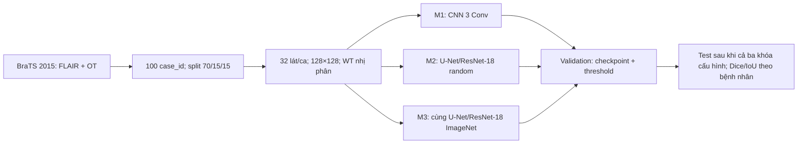

# BraTS 2015 Light Benchmark — M1 / M2 / M3

**Bài toán:** phân đoạn *whole tumor* (WT) nhị phân từ lát MRI FLAIR 2D. M1 là CNN nông; M2 là U-Net với encoder ResNet-18 khởi tạo ngẫu nhiên; M3 dùng đúng kiến trúc M2 với encoder ImageNet và fine-tune. Đây là benchmark nội bộ trên **cùng 100 ca BraTS 2015**, không phải điểm chính thức của challenge.

**Trạng thái kiểm tra:** 201/201 file raw đúng SHA-256; cache đã tạo đủ 100 ca; cả ba `Mx.py --smoke` và ba notebook chạy từ đầu tới cuối trên **Windows `.venv` + CUDA**. Chưa chạy full 3 seed/test, nên chưa có điểm benchmark cuối.

## Cấu trúc đã tạo

```text
Project_midterm/
├── AGENTS.md, README.md, Project_structure.md, Detail_jobs.md
├── requirements.txt              # thư viện bên ngoài; không có package mã nội bộ
├── .venv/                       # Python Windows; không commit
├── M1/
│   ├── M1.ipynb                 # code và Markdown đầy đủ, luồng chính
│   ├── M1.py                    # cùng quy trình, chạy qua PowerShell
│   └── README.md
├── M2/
│   ├── M2.ipynb
│   ├── M2.py
│   └── README.md
├── M3/
│   ├── M3.ipynb
│   ├── M3.py
│   └── README.md
├── data/
│   ├── source_manifest.json     # khóa 100 ca và SHA-1 nguồn
│   ├── splits_v1.csv           # split cố định 70/15/15 theo case_id
│   ├── file_sha256.csv         # checksum 201 file
│   ├── raw/BRATS2015/          # 200 MRI + giấy phép; không commit
│   └── processed/             # cache chung; không commit
├── runs/                       # checkpoint, CSV, hình của mỗi Mx; không commit
├── reports/                    # báo cáo nhóm
└── slides/                     # tài liệu người dùng đang có
```

**Không có `scripts/`, `src/`, notebook chung hoặc package nội bộ.** Mỗi notebook chứa trực tiếp toàn bộ mã của mức đó: kiểm dữ liệu → tiền xử lý → model → loss/metric → train/validation → checkpoint → test → hình. `Mx.py` tự chứa cùng quy trình; không import mã từ notebook hay folder khác. Các thư viện ngoài (`torch`, `torchvision`, `SimpleITK`, `numpy`, `matplotlib`) được cài trong `.venv` chung. Xem [AGENTS.md](AGENTS.md) và [chia việc](Detail_jobs.md).

## Dữ liệu và kiểm tra đã thực hiện

`data/raw/BRATS2015/training/{HGG,LGG}/<patient_id>/...` đã có **200 file `.mha` FLAIR/OT và 1 file giấy phép**. Ngày 28/09/2026, PowerShell Windows kiểm đủ **201/201 file**, đúng kích thước và **SHA-256 khớp `data/file_sha256.csv`**; vì vậy máy này **không cần tải lại**. `data/splits_v1.csv` có 80 HGG + 20 LGG, chia 70 train / 15 validation / 15 test theo `case_id = grade/patient_id`.

Nguồn là [Academic Torrents BraTS 2015](https://academictorrents.com/details/c4f39a0a8e46e8d2174b8a8a81b9887150f44d50), tải các file đã chọn từ [web seed Archive.org](https://archive.org/metadata/BRATS2015). Bản sao HTTPS có 100 HGG và 54 LGG hoàn chỉnh; cohort 100 ca đã được khóa trong `data/source_manifest.json`. Không đưa MRI gốc lên Git.

### Tải lại trên máy Windows khác nếu `data/raw/` trống

Chạy **PowerShell Windows** từ root. Dòng `Set-Location` dưới đây là đường dẫn trên máy hiện tại; khi clone ở vị trí khác, thay bằng đường dẫn root của bản clone. Khối lệnh dùng đúng danh sách file và SHA-1 đã khóa; file hợp lệ được bỏ qua, file thiếu được tải bằng HTTPS vào đúng đường dẫn. `Invoke-WebRequest` là lệnh có sẵn trong PowerShell 5.1. Tôi đã thử tải lại một file giấy phép bị xóa tạm thời, sau đó xác minh 201/201 SHA-256 bằng chính khối lệnh này.

```powershell
Set-Location 'D:\Desktop_informations\SGK năm 4\SGK kì 1 năm 4\DeepLearning - Ngân\Project\Project_midterm'
$source = Get-Content .\data\source_manifest.json -Raw | ConvertFrom-Json
$items = @($source.license_file)
foreach ($case in $source.cases) { $items += $case.flair; $items += $case.mask }
foreach ($item in $items) {
    $target = Join-Path .\data\raw\BRATS2015 ($item.path.Replace('/', [IO.Path]::DirectorySeparatorChar))
    if ((Test-Path -LiteralPath $target) -and
        (Get-Item -LiteralPath $target).Length -eq [int64]$item.bytes -and
        (Get-FileHash -LiteralPath $target -Algorithm SHA1).Hash.ToLowerInvariant() -eq $item.sha1) { continue }
    New-Item -ItemType Directory -Force -Path (Split-Path $target) | Out-Null
    $url = 'https://archive.org/download/BRATS2015/BRATS2015/' + $item.path
    for ($attempt = 1; $attempt -le 4; $attempt++) {
        try {
            Invoke-WebRequest -UseBasicParsing -Uri $url -OutFile $target
            if ((Get-Item -LiteralPath $target).Length -ne [int64]$item.bytes -or
                (Get-FileHash -LiteralPath $target -Algorithm SHA1).Hash.ToLowerInvariant() -ne $item.sha1) {
                throw "Sai kích thước hoặc SHA-1: $target"
            }
            break
        } catch {
            Remove-Item -LiteralPath $target -ErrorAction SilentlyContinue
            if ($attempt -eq 4) { throw }
            Start-Sleep -Seconds (2 * $attempt)
        }
    }
}
$checks = Import-Csv .\data\file_sha256.csv
$bad = @($checks | Where-Object {
    $path = Join-Path .\data\raw\BRATS2015 ($_.path.Replace('/', [IO.Path]::DirectorySeparatorChar))
    -not (Test-Path -LiteralPath $path) -or
    (Get-FileHash -LiteralPath $path -Algorithm SHA256).Hash.ToLowerInvariant() -ne $_.sha256
})
if ($bad.Count -ne 0) { throw "$($bad.Count) file sai checksum" }
"Đã kiểm tra $($checks.Count)/$($checks.Count) file."
```

## Cài môi trường chung trên Windows

Máy hiện có `.venv` tạo bằng **Python Windows 3.12**. Nếu clone sang máy khác, chạy trong PowerShell tại root:

```powershell
py -3.12 -m venv .venv
$ProjectPython = '.\.venv\Scripts\python.exe'
& $ProjectPython -m pip install --upgrade pip
# Cài torch + torchvision bản CUDA phù hợp theo https://pytorch.org/get-started/locally/
& $ProjectPython -m pip install -r requirements.txt
& $ProjectPython -m ipykernel install --user --name brats2015-midterm --display-name 'BraTS 2015 (.venv)'
& $ProjectPython -c "import torch; print(torch.cuda.is_available())"
```

Lấy lệnh cài PyTorch CUDA hiện hành từ [PyTorch Start Locally](https://pytorch.org/get-started/locally/); chọn **Windows / Pip / CUDA** trước bước `requirements.txt`. Trong VS Code/Jupyter, chọn kernel **BraTS 2015 (.venv)** và kiểm `sys.executable` là `.venv\Scripts\python.exe`. Không tạo hoặc dùng môi trường WSL.

**Môi trường đã thử trên máy này:** Python 3.12.10, torch 2.11.0+cu128, torchvision 0.26.0+cu128, SimpleITK 2.5.6, matplotlib 3.11.2, ipykernel 7.3.0; `torch.cuda.is_available()` trả `True`. `pip check` không báo xung đột. Trọng số ImageNet của M3 đã tải được qua `torchvision`.

## Chạy mỗi Mx theo hai cách

**Cách chính — notebook:** mở `M1/M1.ipynb`, `M2/M2.ipynb`, `M3/M3.ipynb` trên Windows, chọn kernel `.venv`, rồi **Restart Kernel + Run All**. Cell cuối mặc định `ACTION = "smoke"`, `SEED = 42`: 1 epoch với 2 ca train/1 ca validation để kiểm quy trình. Đổi `ACTION = "train"` và lần lượt `SEED = 42, 123, 2026` để train đầy đủ. Chỉ chọn `ACTION = "test"` sau khi cả ba Mx có checkpoint full cho cùng seed.

**Cách hai — file `.py` trong chính folder Mx:** từ PowerShell Windows ở root:

```powershell
$ProjectPython = '.\.venv\Scripts\python.exe'
& $ProjectPython .\M1\M1.py --smoke
& $ProjectPython .\M2\M2.py --smoke
& $ProjectPython .\M3\M3.py --smoke
# Huấn luyện cuối (lặp các seed 42, 123, 2026):
& $ProjectPython .\M1\M1.py --train --seed 42
& $ProjectPython .\M2\M2.py --train --seed 42
& $ProjectPython .\M3\M3.py --train --seed 42
# Chỉ sau khi cả ba model đã khóa checkpoint cho seed đó:
& $ProjectPython .\M1\M1.py --test --seed 42
```

`--prepare` ở bất kỳ Mx nào kiểm file và tạo cache cho 100 ca trước khi train. Artifacts nằm ở `runs/smoke/<mx>/<seed>/` hoặc `runs/<mx>/<seed>/`: `best.pt`, `history.csv`, `metrics_val.csv`, `preview.png`, `config.json`; test tạo `metrics_test.csv`. Các Mx dùng cùng `data/splits_v1.csv` và cache `data/processed/flair_wt_v1/`.

## Kiến trúc và benchmark



M2/M3 có class model và decoder giống nhau, được viết đầy đủ trong **cả hai** notebook/file `.py`; khác ở khởi tạo encoder và lịch train M3. Cả ba dùng cùng loss `0.5 BCEWithLogits + 0.5 soft Dice`, ImageNet normalization, batch 16, 30 epoch tối đa và seed cố định. Chỉ dùng validation để chọn checkpoint/ngưỡng. Xem [thiết kế chi tiết](Project_structure.md).

**Phần cứng:** i7-12800H, RTX A4500 Laptop 16 GiB VRAM, khoảng 23 GiB RAM. Dự toán trước đây cho 3 model × 3 seed khoảng 1,5–5,5 giờ GPU, **chưa phải phép đo thực**. Smoke mặc định chỉ kiểm khả năng chạy; không dùng điểm smoke làm kết luận. Kết quả cuối và thời gian thật sẽ được ghi sau khi train đủ.
