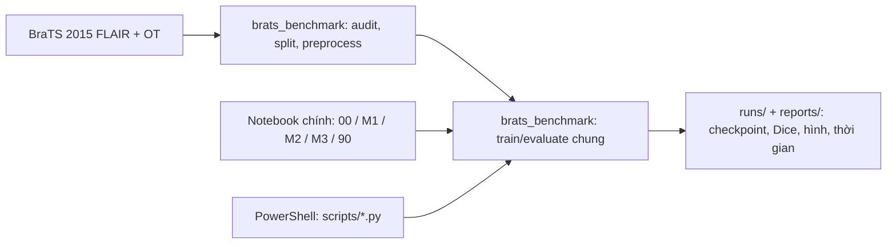
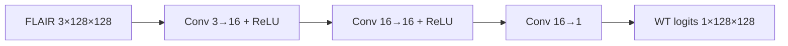
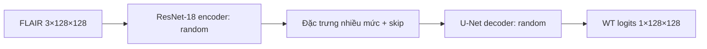
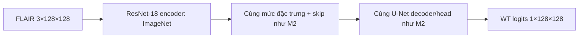

# BraTS 2015 Light Benchmark — M1 / M2 / M3

**Đề tài:** phân đoạn *whole tumor* (WT) trên MRI FLAIR 2D của BraTS 2015. Mục tiêu là so sánh mạng đơn giản (M1), mạng sâu (M2) và transfer learning/fine-tune (M3) trên **cùng bệnh nhân, cùng ảnh đầu vào, cùng nhãn và cùng giao thức đánh giá**. Đây là benchmark nội bộ trên tập con, không phải điểm chính thức của BraTS.

> **Trạng thái hiện tại:** cây thư mục, Windows `.venv`, config, package khung, script tải/kiểm tra dữ liệu, manifest, checksum và README của M1/M2/M3 đã được tạo; **201/201 file dữ liệu đã qua kiểm tra** trên máy này. **Notebook huấn luyện, pipeline mô hình và script train/evaluate vẫn là công việc của các thành viên**; chưa có điểm thực nghiệm. Trong cây bên dưới, các file `.ipynb` và Python entry point train/evaluate/compare/profile là **mục tiêu tiếp theo**.

- [Thiết kế dataset, mô hình và benchmark](Project_structure.md)
- [Danh sách việc và phân công 1 Mx / 1 thành viên](Detail_jobs.md)
- [Quy tắc cho agent và người đóng góp](AGENTS.md)

## Hai cách chạy bắt buộc trên Windows

**Cách chính — notebook `.ipynb`:** chạy `notebooks/00_prepare.ipynb`, sau đó `M1/M1.ipynb`, `M2/M2.ipynb`, `M3/M3.ipynb`; cuối cùng `notebooks/90_compare.ipynb`. Mỗi notebook phải chạy được bằng **Restart Kernel + Run All** với kernel Windows `.venv`, không cần chạy notebook khác để giữ biến trong bộ nhớ.

**Cách thứ hai — PowerShell gọi file Python:** từ project root, chạy `scripts/prepare_data.py`, `scripts/train.py --model m1|m2|m3`, `scripts/evaluate.py` và `scripts/compare.py` bằng `.\.venv\Scripts\python.exe`. Notebook và script chỉ là hai entry point; cả hai gọi chung các hàm trong `src/brats_benchmark/`. Vì vậy, đổi cách chạy không đổi split, preprocessing, loss hay metric.



## Ba mô hình, một benchmark

| Mức | Kiến trúc | Khởi tạo | Input → output |
|---|---|---|---|
| **M1** | CNN/FCN nông, 3 Conv 3×3 | Ngẫu nhiên | `3×128×128 → 1×128×128` logits |
| **M2** | U-Net 2D, encoder ResNet-18 | Toàn bộ ngẫu nhiên | `3×128×128 → 1×128×128` logits |
| **M3** | **Cùng U-Net/ResNet-18 và decoder của M2** | Encoder ImageNet; decoder/head ngẫu nhiên, rồi fine-tune | `3×128×128 → 1×128×128` logits |

Một lát FLAIR được lặp sang ba kênh; cả ba mô hình dùng cùng tensor. M2/M3 dùng cùng factory mô hình; M3 học decoder/head khi đóng băng encoder trong 5 epoch, sau đó mở `layer4` tối đa 25 epoch. Điểm M2–M3 phản ánh **cả pretrained weights và lịch fine-tune**. Cùng 100 bệnh nhân (80 HGG, 20 LGG), split theo bệnh nhân 70/15/15, 32 lát/ca, mask WT = OT `{1,2,3,4}`, ảnh 128×128, loss, seeds và metric. Chọn checkpoint/ngưỡng trên validation; chỉ mở test khi cấu hình cả ba đã khóa.

### M1 — baseline CNN nông



### M2 — U-Net/ResNet-18 từ đầu



### M3 — cùng U-Net/ResNet-18 với transfer learning



## Cấu trúc repository mục tiêu

```text
Project_midterm/
├── AGENTS.md                      # Quy tắc Windows, notebook + PowerShell, benchmark
├── README.md                      # Tổng quan và hướng dẫn dùng
├── Project_structure.md           # Thiết kế kỹ thuật, sơ đồ, giao thức
├── Detail_jobs.md                 # Phân công và tiêu chí bàn giao
├── pyproject.toml                 # Cài package src/ ở chế độ editable
├── requirements.txt               # Package phụ trợ; PyTorch CUDA theo selector chính thức
├── .gitignore                     # .venv, dữ liệu, cache, checkpoint
├── .gitattributes                 # Chuẩn hóa line endings cho Windows/Git
├── .venv/                         # Tạo bằng Python Windows; không commit
├── configs/
│   ├── benchmark.yaml             # Quy tắc chung: data, split, 32 lát, seeds, metric
│   ├── m1.yaml
│   ├── m2.yaml
│   └── m3.yaml
├── notebooks/
│   ├── 00_prepare.ipynb           # Audit, chọn bệnh nhân, tạo split/cache
│   └── 90_compare.ipynb           # Bảng benchmark, hình, phân tích lỗi
├── M1/
│   ├── M1.ipynb                   # Notebook chạy chính của thành viên M1
│   └── README.md                  # Giải thích mô hình và kết quả M1
├── M2/
│   ├── M2.ipynb                   # Notebook chạy chính của thành viên M2
│   └── README.md                  # Giải thích mô hình và kết quả M2
├── M3/
│   ├── M3.ipynb                   # Notebook chạy chính của thành viên M3
│   └── README.md                  # Giải thích mô hình và kết quả M3
├── scripts/
│   ├── download_dataset.py        # Đã có: tải 100 cặp FLAIR–OT qua HTTPS
│   ├── verify_dataset.py          # Đã có: kiểm file/size/header/split/hash
│   ├── prepare_data.py            # PowerShell option: chuẩn bị dataset
│   ├── train.py                   # PowerShell option: --model m1|m2|m3 --seed ...
│   ├── evaluate.py                # PowerShell option: đánh giá checkpoint đã khóa
│   ├── compare.py                 # PowerShell option: tổng hợp kết quả
│   └── profile.py                 # Đo thời gian và peak VRAM
├── src/brats_benchmark/
│   ├── __init__.py
│   ├── config.py                   # Đọc config và project root
│   ├── pipeline.py                 # API chung cho notebook và script
│   ├── data/                       # MHA reader, audit, split, preprocess, Dataset
│   ├── models/                     # M1; factory U-Net dùng chung M2/M3
│   ├── training/                   # Loss, trainer, checkpoint, AMP
│   └── evaluation/                 # Metric theo bệnh nhân, bootstrap, plots
├── tests/                          # Split/leakage, mask/shape, metric, entrypoint
├── data/
│   ├── README.md
│   ├── metadata/brats2015.torrent # Cache metadata; không commit
│   ├── raw/                       # Không commit
│   ├── processed/                 # Không commit
│   ├── source_manifest.json
│   ├── splits_v1.csv
│   ├── file_sha256.csv             # Sinh sau khi tải xong 201 file
│   └── excluded_cases.csv
├── runs/<m1|m2|m3>/<seed>/        # config, history, best.pt, threshold
└── reports/
    ├── figures/
    ├── hardware_profile.md
    ├── benchmark.csv
    ├── per_patient.csv
    ├── report.md
    └── slides.pdf
```

Mã lõi ở `src/` để notebook và script không lặp logic. `M1/`, `M2/`, `M3/` là nơi thành viên trình bày thí nghiệm của mình; checkpoint và CSV đặt ở `runs/`/`reports/` theo format chung. `pyproject.toml` cho phép cài `src/brats_benchmark` dạng editable thay vì sửa `sys.path` trong notebook.

## Tải tập con BraTS 2015 bằng PowerShell Windows — đã kiểm tra

Chạy trong **PowerShell Windows**; script tải trực tiếp qua HTTPS từ web seed Archive.org được liệt kê trong [torrent gốc của Academic Torrents](https://academictorrents.com/download/c4f39a0a8e46e8d2174b8a8a81b9887150f44d50.torrent). Không cần WSL, không cần torrent client, không cần package Python ngoài thư viện chuẩn và không cần `.venv` để tải:

```powershell
Set-Location 'D:\Desktop_informations\SGK năm 4\SGK kì 1 năm 4\DeepLearning - Ngân\Project\Project_midterm'
py -3.12 .\scripts\download_dataset.py --workers 4
py -3.12 .\scripts\verify_dataset.py --write-checksums
```

Lệnh chọn cố định **80 HGG + 20 LGG**, tải **200 file `.mha` FLAIR/OT + 1 file giấy phép**, tổng **0,870 GiB** theo metadata, vào `data/raw/BRATS2015/training/{HGG,LGG}/<patient_id>/...`. Torrent gốc có nhiều ca hơn, nhưng [inventory Archive.org](https://archive.org/metadata/BRATS2015) chỉ có **100 ca HGG và 54 ca LGG hoàn chỉnh** (có cả FLAIR và OT). Script đối chiếu path/kích thước với torrent đã xác minh trước khi chọn, rồi kiểm SHA-1 của từng file khi tải và khi chạy lại; danh sách 100 ca được khóa trong `data/source_manifest.json` để lần chạy sau và máy khác không đổi tập con khi mirror thay đổi. `data/splits_v1.csv` dùng **`case_id = grade/patient_id`**, tránh trùng ID giữa hai nhóm. Ảnh gốc nằm trong `.gitignore`; manifest và bảng checksum nhỏ được đưa lên Git.

**Kiểm tra đã thực hiện:** PowerShell Windows/Python 3.12 tải đủ 200 MRI + giấy phép vào đúng thư mục. Lần chạy lại báo **201/201 `already_present`** sau khi đối chiếu kích thước và SHA-1 gốc. `verify_dataset.py --write-checksums` báo **201/201 hợp lệ, 0 thiếu, 0 sai**, xác nhận split 70/15/15 và tạo `data/file_sha256.csv`. Nếu mạng ngắt ở máy khác, chạy lại cùng lệnh sẽ kiểm tra file đã có và tải phần còn thiếu.

[Academic Torrents hướng dẫn tải torrent](https://academictorrents.com/docs/getting-started.html). Đường HTTPS đã thử trực tiếp là `https://archive.org/download/BRATS2015/BRATS2015/training/...`; downloader tự lấy tên file chuẩn từ metadata, không cần tự viết 200 URL.

## Cài và chạy sau khi các file mục tiêu được triển khai

Mở **PowerShell Windows** tại project root. `py -3.12` hiện có trên máy; tạo `.venv` bằng chính Python Windows. Có thể dùng trực tiếp interpreter của `.venv` mà không cần `Activate.ps1`:

```powershell
py -3.12 -m venv .venv
$ProjectPython = '.\.venv\Scripts\python.exe'
& $ProjectPython -m pip install --upgrade pip
# Cài torch/torchvision CUDA theo Windows + Pip + CUDA ở https://docs.pytorch.org/get-started/locally/
& $ProjectPython -m pip install -r requirements.txt
& $ProjectPython -m pip install -e .
& $ProjectPython -m ipykernel install --user --name brats2015-midterm --display-name 'BraTS 2015 (.venv)'
& $ProjectPython -c "import torch; print(torch.cuda.is_available())"
```

Bước cài PyTorch cần lấy **lệnh đúng cho máy tại thời điểm cài** từ [PyTorch Start Locally](https://docs.pytorch.org/get-started/locally/). [Python `venv`](https://docs.python.org/3.12/library/venv.html) cho phép gọi `Scripts\python.exe` trực tiếp; [IPython](https://ipython.readthedocs.io/en/stable/install/index.html) hướng dẫn đăng ký kernel. Trong VS Code/Jupyter, chọn kernel **BraTS 2015 (.venv)** hoặc interpreter `.venv\Scripts\python.exe`, rồi xác nhận `sys.executable` và `torch.cuda.is_available()` trong notebook. Xem [hướng dẫn chọn kernel của VS Code](https://code.visualstudio.com/docs/datascience/jupyter-kernel-management).

Khi script đã được triển khai, PowerShell gọi cùng pipeline như notebook:

```powershell
$ProjectPython = '.\.venv\Scripts\python.exe'
& $ProjectPython .\scripts\prepare_data.py --config .\configs\benchmark.yaml
& $ProjectPython .\scripts\profile.py --model m2
& $ProjectPython .\scripts\train.py --model m1 --seed 42
& $ProjectPython .\scripts\train.py --model m2 --seed 42
& $ProjectPython .\scripts\train.py --model m3 --seed 42
# Sau khi hoàn thành mọi seed, chọn xong checkpoint/ngưỡng trên validation:
& $ProjectPython .\scripts\evaluate.py --split test
& $ProjectPython .\scripts\compare.py
```

Các ví dụ PowerShell trên là **giao diện cần hiện thực**, chưa chạy được trong trạng thái repo hiện tại. Notebook là luồng chính; script là cách tái lập/automation. Cả hai phải tạo cùng định dạng artifact và cùng kết quả khi đọc một checkpoint đã khóa.

## Phần cứng và thời gian dự kiến

Máy đã thấy **i7-12800H, RTX A4500 Laptop 16 GB VRAM, khoảng 23 GiB RAM**; PowerShell 5.1 và Python Windows 3.12 có sẵn. Python Windows hiện **chưa cài PyTorch, ipykernel, JupyterLab, SimpleITK**, nên dưới đây chỉ là ước lượng cho 100 ca × 32 lát, 128×128, tối đa 30 epoch, batch hiệu dụng 16:

| Mức | Train 1 seed | Train 3 seed | Inference 32 lát/ca, model GPU |
|---|---:|---:|---:|
| M1 | 2–10 phút | 6–30 phút | dưới 0,5 giây |
| M2 | 15–50 phút | 45–150 phút | khoảng 0,2–2 giây |
| M3 | 12–45 phút | 36–135 phút | khoảng 0,2–2 giây |

**Tổng ba mô hình × ba seed:** khoảng **1,5–5,5 giờ**, chưa tính tải, audit và tiền xử lý. Đây là dự toán từ cấu hình bài toán, **chưa đo bằng PyTorch Windows**. Sau khi có package/data, dùng `scripts/profile.py` trên Windows để ghi tốc độ thực, peak VRAM, thời gian I/O vào `reports/hardware_profile.md`; cập nhật lịch chạy theo số đo đó.

## Nguồn đọc nhanh

- [BraTS 2015 dataset](https://academictorrents.com/details/c4f39a0a8e46e8d2174b8a8a81b9887150f44d50) và [bài báo BRATS](https://pmc.ncbi.nlm.nih.gov/articles/PMC4833122/).
- [Fully Convolutional Networks](https://openaccess.thecvf.com/content_cvpr_2015/html/Long_Fully_Convolutional_Networks_2015_CVPR_paper.html), [U-Net](https://arxiv.org/abs/1505.04597), [ResNet](https://openaccess.thecvf.com/content_cvpr_2016/html/He_Deep_Residual_Learning_CVPR_2016_paper.html).
- [PyTorch transfer learning](https://docs.pytorch.org/tutorials/beginner/transfer_learning_tutorial.html), [Segmentation Models PyTorch](https://github.com/qubvel-org/segmentation_models.pytorch/blob/main/docs/quickstart.rst). Nguồn chuyên sâu theo từng thành viên nằm trong `Detail_jobs.md`.
